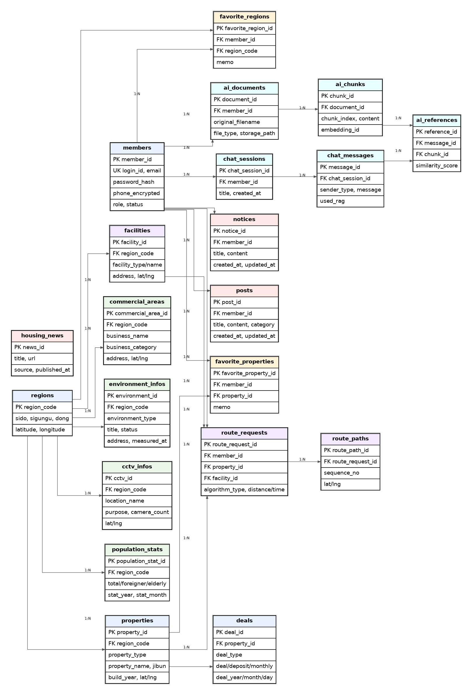

# WhereIsMyHouse AI Navigator - DB 설계 README

## 1. 프로젝트 개요

**WhereIsMyHouse AI Navigator**는 공공데이터 기반 주택 실거래가 조회 서비스에 회원 관리, 관심지역, 주변 상권/환경 정보, 알고리즘 기반 경로 탐색, AI ChatBot/RAG 기능을 확장한 주거 의사결정 지원 서비스이다.

본 README는 DB PJT 요구사항에 맞추어 다음 내용을 포함한다.

- 요구사항 분석
- 데이터베이스 설계 방향
- ERD
- 테이블 설명
- PK / FK / INDEX / DEFAULT 설계
- Service / DAO 설계 방향
- 초기 데이터 및 더미 데이터 활용 계획

---

## 2. DB PJT 요구사항 반영 범위

DB 프로젝트 요구사항은 크게 다음 범위로 정리할 수 있다.

| 구분 | 요구사항 | 반영 테이블 |
|---|---|---|
| 필수 | 동별, 아파트별 매매/전월세 실거래가 정보 저장 및 조회 | `regions`, `properties`, `deals` |
| 필수 | 회원정보 관리 | `members` |
| 필수 | 관심지역 관리 | `favorite_regions` |
| 필수 | 주택 실거래가 정보를 통해 주택 기본 정보 관리 | `properties`, `deals` |
| 추가 | 동네 업종 정보 관리 | `commercial_areas` |
| 추가 | 동네 환경 점검 정보 관리 | `environment_infos` |
| 심화 | CCTV 설치 현황 정보 검색 | `cctv_infos` |
| 심화 | 공지사항 / 게시판 CRUD | `notices`, `posts` |
| 확장 | 지역 구성원 정보 검색 | `population_stats` |
| 확장 | A* 최단 경로 탐색 | `facilities`, `route_requests`, `route_paths` |
| 확장 | ChatBot / RAG 문서 검색 | `ai_documents`, `ai_chunks`, `chat_sessions`, `chat_messages`, `ai_references` |

---

## 3. ERD

아래 ERD는 필수 기능, 추가 기능, 심화 기능, ChatBot/RAG 확장 기능을 모두 포함한 전체 데이터 모델이다.



---

## 4. 설계 핵심

### 4.1 지역 중심 설계

서비스의 핵심 검색 기준은 **법정동**이다.  
따라서 `regions`를 중심 테이블로 두고, 주택, 상권, 환경, CCTV, 인구 통계, 시설 정보를 모두 지역 코드로 연결한다.

```text
regions
 ├─ properties
 ├─ commercial_areas
 ├─ environment_infos
 ├─ cctv_infos
 ├─ population_stats
 └─ facilities
```

### 4.2 주택 정보와 거래 이력 분리

하나의 주택은 여러 번 거래될 수 있다.  
따라서 주택 기본 정보는 `properties`, 거래 이력은 `deals`로 분리한다.

```text
properties 1 : N deals
```

이렇게 분리하면 다음 검색이 가능하다.

- 법정동 기준 실거래가 검색
- 아파트명 기준 실거래가 검색
- 아파트 / 다세대주택 구분 검색
- 매매 / 전월세 구분 검색
- 선택 주택 상세 거래 이력 조회

### 4.3 회원과 관심 기능 분리

회원은 여러 관심지역과 관심매물을 등록할 수 있다.

```text
members 1 : N favorite_regions
members 1 : N favorite_properties
```

중복 등록 방지를 위해 다음 UNIQUE 제약조건을 둔다.

```sql
UNIQUE (member_id, region_code)
UNIQUE (member_id, property_id)
```

### 4.4 주변 생활 정보 확장

관심지역 기반 기능을 위해 상권, 환경, CCTV, 인구 통계를 별도 테이블로 분리한다.

| 테이블 | 목적 |
|---|---|
| `commercial_areas` | 주변 상권 / 업종 정보 |
| `environment_infos` | 녹지, 폐수배출, 대기배출 등 환경 정보 |
| `cctv_infos` | CCTV 설치 현황 |
| `population_stats` | 외국인 수, 고령자 수 등 지역 구성원 정보 |

### 4.5 알고리즘 기능 확장

A* 최단 경로 탐색은 다음 구조로 관리한다.

| 테이블 | 설명 |
|---|---|
| `facilities` | 지하철역, 학교, 병원, 공원 등 목적지 |
| `route_requests` | 사용자가 요청한 경로 탐색 기록 |
| `route_paths` | 계산된 경로 좌표 목록 |

A* 알고리즘 자체의 탐색 과정은 Java Service에서 수행하고, DB에는 요청 결과와 경로 좌표를 저장한다.

### 4.6 ChatBot / RAG 확장

ChatBot 기능은 기본 대화와 문서 기반 RAG 기능을 모두 고려한다.

| 테이블 | 설명 |
|---|---|
| `ai_documents` | 업로드된 txt, md, pdf 문서 메타데이터 |
| `ai_chunks` | 청킹된 문서 조각 |
| `chat_sessions` | 사용자별 채팅 세션 |
| `chat_messages` | 사용자 질문 / AI 응답 |
| `ai_references` | AI 응답이 참고한 문서 청크 |

벡터 자체는 MySQL에 저장하지 않고, 벡터 DB의 ID를 `embedding_id`로 저장한다.

---

## 5. 테이블 상세 설명

## 5.1 `members`

회원가입, 로그인, 회원조회, 회원수정, 회원삭제, 비밀번호 찾기 기능을 위한 테이블이다.

| 컬럼 | 설명 |
|---|---|
| `member_id` | 회원 PK |
| `login_id` | 로그인 ID, UNIQUE |
| `password_hash` | Bcrypt 해시 비밀번호 |
| `name` | 회원 이름 |
| `email` | 이메일, UNIQUE |
| `phone_encrypted` | RSA 등으로 암호화된 전화번호 |
| `role` | USER / ADMIN |
| `status` | ACTIVE / DELETED |

---

## 5.2 `regions`

법정동 기준 검색을 위한 지역 테이블이다.

| 컬럼 | 설명 |
|---|---|
| `region_code` | 법정동 코드 PK |
| `sido` | 시도 |
| `sigungu` | 시군구 |
| `dong` | 읍면동 |
| `latitude`, `longitude` | 지도 표시용 중심 좌표 |

---

## 5.3 `properties`

아파트, 연립다세대 등 주택 기본 정보 테이블이다.

| 컬럼 | 설명 |
|---|---|
| `property_id` | 주택 PK |
| `region_code` | 법정동 FK |
| `property_type` | APT, ROW_HOUSE 등 |
| `property_name` | 아파트명 / 주택명 |
| `jibun` | 지번 |
| `build_year` | 건축년도 |
| `exclusive_area` | 전용면적 |
| `latitude`, `longitude` | 지도 표시 좌표 |

---

## 5.4 `deals`

매매 / 전월세 거래 이력 테이블이다.

| 컬럼 | 설명 |
|---|---|
| `deal_id` | 거래 PK |
| `property_id` | 주택 FK |
| `deal_type` | SALE / RENT |
| `deal_amount` | 매매가 |
| `deposit_amount` | 보증금 |
| `monthly_rent` | 월세 |
| `deal_year`, `deal_month`, `deal_day` | 거래일 |
| `floor` | 층 |
| `source_type` | APT_SALE, APT_RENT, HOME_SALE, HOME_RENT |

---

## 5.5 `favorite_regions`

회원별 관심지역 테이블이다.

| 컬럼 | 설명 |
|---|---|
| `favorite_region_id` | 관심지역 PK |
| `member_id` | 회원 FK |
| `region_code` | 지역 FK |
| `memo` | 사용자 메모 |

---

## 5.6 `favorite_properties`

회원별 관심매물 테이블이다.

| 컬럼 | 설명 |
|---|---|
| `favorite_property_id` | 관심매물 PK |
| `member_id` | 회원 FK |
| `property_id` | 주택 FK |
| `memo` | 사용자 메모 |

---

## 5.7 `commercial_areas`

주변 상권 / 업종 정보를 저장하는 테이블이다.

| 컬럼 | 설명 |
|---|---|
| `commercial_area_id` | 상권 정보 PK |
| `region_code` | 지역 FK |
| `business_name` | 상호명 |
| `business_category` | 업종 |
| `address` | 주소 |
| `latitude`, `longitude` | 지도 표시 좌표 |

---

## 5.8 `environment_infos`

녹지, 폐수배출, 대기배출 등 주변 환경 정보를 저장한다.

| 컬럼 | 설명 |
|---|---|
| `environment_id` | 환경 정보 PK |
| `region_code` | 지역 FK |
| `environment_type` | GREEN, WASTEWATER, AIR 등 |
| `title` | 정보명 |
| `status` | 상태 |
| `address` | 주소 |
| `measured_at` | 측정일 |

---

## 5.9 `cctv_infos`

동네 CCTV 설치 현황 정보를 저장한다.

| 컬럼 | 설명 |
|---|---|
| `cctv_id` | CCTV PK |
| `region_code` | 지역 FK |
| `location_name` | 설치 위치 |
| `purpose` | 설치 목적 |
| `camera_count` | 카메라 수 |

---

## 5.10 `population_stats`

외국인 수, 고령자 수 등 지역 구성원 통계 정보를 저장한다.

| 컬럼 | 설명 |
|---|---|
| `population_stat_id` | 통계 PK |
| `region_code` | 지역 FK |
| `total_population` | 총 인구 |
| `foreigner_count` | 외국인 수 |
| `elderly_count` | 고령자 수 |
| `stat_year`, `stat_month` | 통계 기준년월 |

---

## 5.11 `facilities`, `route_requests`, `route_paths`

A* 기반 최단 경로 탐색 기능을 위한 테이블이다.

```text
properties → route_requests ← facilities
route_requests → route_paths
```

| 테이블 | 설명 |
|---|---|
| `facilities` | 지하철역, 학교, 병원, 공원 등 목적지 |
| `route_requests` | 경로 탐색 요청과 결과 요약 |
| `route_paths` | 경로를 구성하는 좌표 목록 |

---

## 5.12 `notices`, `posts`, `housing_news`

공지사항, 게시판, 주택 관련 뉴스 기능을 위한 테이블이다.

| 테이블 | 설명 |
|---|---|
| `notices` | 공지사항 등록, 수정, 삭제, 조회 |
| `posts` | 공유게시판 CRUD |
| `housing_news` | 주택 관련 뉴스 수집 및 제공 |

---

## 5.13 `ai_documents`, `ai_chunks`, `chat_sessions`, `chat_messages`, `ai_references`

ChatBot / RAG 기능을 위한 테이블이다.

```text
members → ai_documents → ai_chunks
members → chat_sessions → chat_messages → ai_references → ai_chunks
```

| 테이블 | 설명 |
|---|---|
| `ai_documents` | 업로드 문서 정보 |
| `ai_chunks` | 문서 청크 |
| `chat_sessions` | 채팅 세션 |
| `chat_messages` | 질문 / 응답 메시지 |
| `ai_references` | 응답에 사용된 문서 근거 |

---

## 6. 주요 인덱스 설계

| 인덱스 | 목적 |
|---|---|
| `idx_properties_region` | 법정동 기준 주택 검색 |
| `idx_properties_name` | 아파트 이름 검색 |
| `idx_properties_type` | 아파트 / 다세대주택 구분 검색 |
| `idx_deals_type` | 매매 / 전월세 구분 검색 |
| `idx_deals_date` | 최근 거래일 정렬 |
| `idx_deals_amount` | 가격 기준 정렬 |
| `idx_commercial_region` | 관심지역 주변 상권 조회 |
| `idx_environment_region` | 관심지역 환경 정보 조회 |
| `idx_cctv_region` | CCTV 현황 조회 |
| `idx_chat_messages_session` | 채팅 세션별 메시지 조회 |

---

## 7. Service / DAO 설계 방향

DB PJT에서는 DB 설계뿐 아니라 MVC의 Model 역할인 Service, DAO 구현이 중요하다.

```text
Controller
  ↓
Service
  ↓
DAO / Repository
  ↓
MySQL
```

### 7.1 부동산 도메인

```text
PropertyService
PropertyDao
DealService
DealDao
RegionService
RegionDao
```

주요 기능:

- XML 파싱 결과 DB 저장
- 법정동 기준 실거래가 검색
- 아파트명 기준 실거래가 검색
- 주택 유형 / 거래 유형 조건 검색
- 상세 거래정보 조회

### 7.2 회원 도메인

```text
MemberService
MemberDao
AuthService
```

주요 기능:

- 회원가입
- 로그인
- 회원조회
- 회원수정
- 회원삭제
- 비밀번호 찾기

### 7.3 관심지역 도메인

```text
FavoriteRegionService
FavoriteRegionDao
FavoritePropertyService
FavoritePropertyDao
```

주요 기능:

- 관심지역 등록
- 관심지역 우선 검색
- 관심매물 등록
- 관심매물 조회

### 7.4 생활 정보 도메인

```text
CommercialAreaService
EnvironmentInfoService
CctvInfoService
PopulationStatService
```

주요 기능:

- 관심지역 주변 상권 조회
- 환경 정보 조회
- CCTV 정보 조회
- 지역 구성원 정보 조회

### 7.5 알고리즘 도메인

```text
RouteService
AStarService
FacilityDao
RouteDao
```

주요 기능:

- 매물과 시설 간 최단 경로 계산
- 경로 탐색 결과 저장
- 경로 좌표 조회

### 7.6 ChatBot / RAG 도메인

```text
ChatService
DocumentService
RagService
AiDocumentDao
ChatMessageDao
```

주요 기능:

- 사용자 질문 저장
- AI 응답 저장
- 문서 업로드 정보 저장
- 문서 청크 정보 저장
- RAG 참고 문서 기록 저장

---

## 8. DDL 파일

DDL SQL은 다음 경로에 작성한다.

```text
db/schema.sql
```

주요 설계 요소:

- PK 설정
- FK 설정
- UNIQUE 제약조건 설정
- INDEX 설정
- DEFAULT 값 설정
- 생성일 / 수정일 컬럼 설정

---

## 9. 초기 데이터 및 더미 데이터 계획

| 데이터 | 사용 목적 |
|---|---|
| 법정동 코드 | 지역 검색 |
| AptInfo.xml 파싱 데이터 | 주택 기본 정보 |
| AptDealHistory.xml | 아파트 매매 실거래가 |
| AptRentHistory.xml | 아파트 전월세 실거래가 |
| HomeDealHistory.xml | 연립다세대 매매 실거래가 |
| HomeRentHistory.xml | 연립다세대 전월세 실거래가 |
| 더미 회원 | 회원 기능 테스트 |
| 더미 관심지역 | 관심지역 기능 테스트 |
| 더미 상권 / 환경 / CCTV | 추가·심화 기능 시연 |
| 더미 AI 문서 | RAG 기능 시연 |

---

## 10. 구현 우선순위

### 1단계: 필수 기능

- `regions`
- `properties`
- `deals`
- `members`
- `favorite_regions`

### 2단계: 추가 기능

- `favorite_properties`
- `commercial_areas`
- `environment_infos`
- `population_stats`

### 3단계: 심화 기능

- `cctv_infos`
- `notices`
- `posts`
- `housing_news`

### 4단계: 차별화 기능

- `facilities`
- `route_requests`
- `route_paths`
- `ai_documents`
- `ai_chunks`
- `chat_sessions`
- `chat_messages`
- `ai_references`

---

## 11. 기대 효과

- 실거래가 데이터와 주택 기본 정보를 분리하여 중복을 줄이고 정규화된 구조 확보
- 법정동, 아파트명, 거래유형, 주택유형 검색에 필요한 인덱스 설계
- 회원, 관심지역, 관심매물 기능을 회원 중심으로 확장 가능
- 상권, 환경, CCTV, 인구 통계 등 주변 생활 정보 확장 가능
- A* 최단 경로, AI RAG 등 차별화 기능을 DB 구조와 연결 가능
- DB PJT 산출물인 README, ERD, DDL SQL 파일 제출 가능

---

## 12. 파일 구성 예시

```text
whereismyhouse-db/
├── README.md
├── images/
│   └── erd.png
└── db/
    └── schema.sql
```
