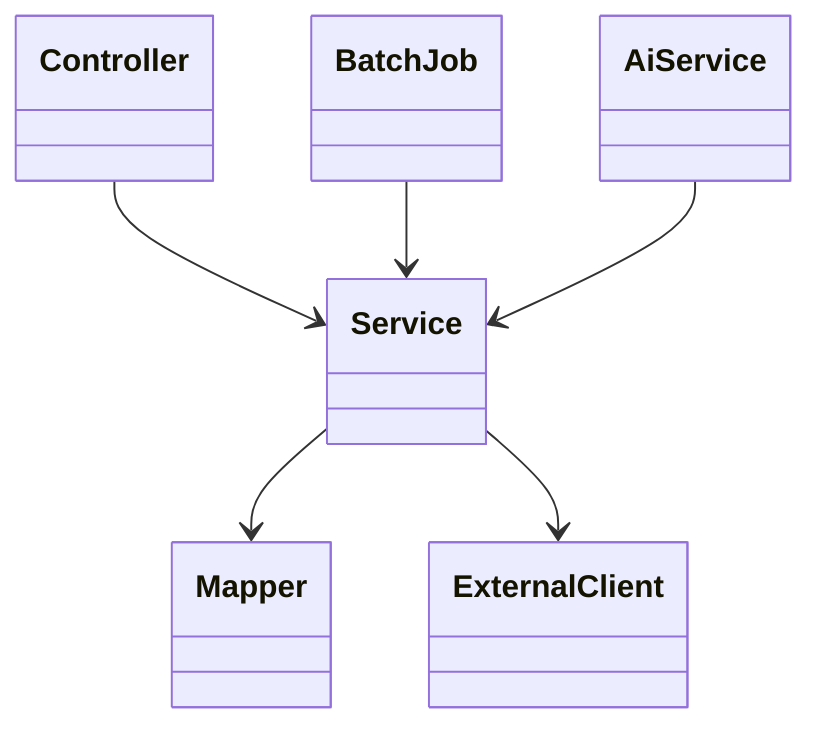

# 클래스 다이어그램

- 기준: 현재 백엔드 production Java 코드
- 대상 모듈: `main-service`, `admin-service`, `ai-service`, `gateway`
- 마지막 최신화: 2026-06-26

---

## 전체 클래스 다이어그램

> 전체 클래스 수가 많아 확대 확인은 SVG 파일을 권장한다.

PNG 파일: [class-diagram.png](./class-diagram.png)

---

## 모듈별 주요 책임

| 모듈 | 주요 책임 |
|------|----------|
| `main-service` | 사용자 서비스 API, 주택 검색, 관심 지역, 게시판, 공지사항, Q&A, 경로 탐색 |
| `admin-service` | 배치 실행/관리, 외부 공공 데이터 수집, 관리자 공지/Q&A 관리, PDF 리포트 생성 |
| `ai-service` | Spring AI 기반 ChatClient, RAG 챗봇, Tool Calling, 배치 리포트 AI 요약 |
| `gateway` | 서비스 라우팅 진입점 |

---

## 핵심 의존 방향

---

## 주요 클래스 그룹

| 그룹 | 대표 클래스 |
|------|-------------|
| 주택 검색 | `HouseController`, `HouseService`, `HouseMapper` |
| 경로 탐색 | `RouteController`, `RouteService`, `AStarAlgorithm`, `AStarPathFinder`, `GraphCacheService` |
| 회원/인증 | `MemberController`, `MemberService`, `AuthController`, `AuthService`, `AuthInterceptor` |
| 게시판/Q&A/공지 | `BoardController`, `QnaController`, `NoticeController` 및 각 Service/Mapper |
| 배치 수집 | `AdminBatchController`, `BatchJobService`, 각 `*CollectJobConfig`, Reader/Processor/Writer |
| AI/RAG | `ChatbotController`, `ChatbotService`, `DocumentService`, `ToolCallingService`, `BatchReportSummaryService` |

---

## 최신화 메모

- Wiki에는 별도 클래스 다이어그램 문서가 없어 현재 코드와 기존 생성 다이어그램을 기준으로 최신화했다.
- 전체 다이어그램은 414개 production Java 타입을 포함한다.
- 상세 관계는 `artifact/class-diagram.svg`에서 확인한다.
