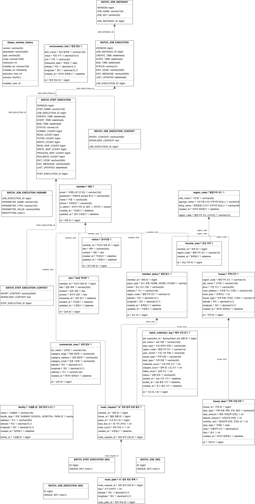

# ERD

- 기준: 사용자가 `artifact/` 바로 하위에 추가한 ERD 이미지
- 이미지 파일: [ERD.png](./ERD.png)
- 마지막 최신화: 2026-06-26

---

## ERD 이미지

---

## 주요 테이블 그룹

| 그룹 | 테이블 |
|------|--------|
| 지역/주택 | `region_code`, `house`, `house_deal` |
| 회원/인증 | `member`, `favorite_area`, `member_place` |
| 게시판 | `notice`, `qna`, `board` |
| 주변 정보 | `commercial_area`, `environment_info`, `cctv`, `population`, `foreign_resident` |
| 배치/리포트 | `batch_collection_log`, `batch_report` |
| 경로 탐색 | `route_node`, `route_edge`, facility 관련 테이블 |

---

## 관계 요약

| 관계 | 설명 |
|------|------|
| 행정구역 - 주택 | 하나의 행정구역에 여러 주택 단지가 속한다. |
| 주택 - 거래 | 하나의 주택은 여러 실거래 이력을 가진다. |
| 회원 - 관심 지역 | 회원은 여러 관심 지역을 등록할 수 있다. |
| 회원 - 장소 | 회원은 집, 회사, 기타 장소를 저장할 수 있다. |
| 노드 - 엣지 | A* 경로 탐색을 위한 그래프 관계를 구성한다. |
| 배치 로그 - 리포트 | 수집/처리 결과를 리포트 생성과 운영 점검에 활용한다. |

---

## 최신화 메모

- Wiki의 `ERD.md`는 비어 있어 사용자 제공 이미지(`artifact/ERD.png`)를 기준 산출물로 사용했다.
- 기존 세부 DB 설명은 `artifact/docs/04_database/`에 남아 있으며, 제출용 최상위 문서는 이 파일을 기준으로 한다.
