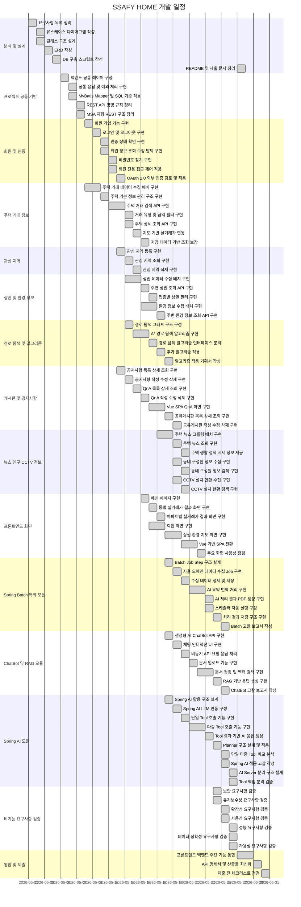

# 간트 차트

```mermaid
gantt
    title SSAFY HOME 개발 일정
    dateFormat  YYYY-MM-DD

    section 분석 및 설계
    요구사항 목록 정리                  :done, a1, 2026-05-01, 1d
    유스케이스 다이어그램 작성           :done, a2, 2026-05-02, 1d
    클래스 구조 설계                    :done, a3, 2026-05-02, 1d
    ERD 작성                            :done, a4, 2026-05-03, 1d
    DB 구축 스크립트 작성                :done, a5, 2026-05-04, 1d
    README 및 제출 문서 정리             :done, a6, 2026-05-27, 1d

    section 프로젝트 공통 기반
    백엔드 공통 레이어 구성              :done, b1, 2026-05-05, 1d
    공통 응답 및 예외 처리 구현          :done, b2, 2026-05-06, 1d
    MyBatis Mapper 및 SQL 기준 적용      :done, b3, 2026-05-06, 1d
    REST API 명명 규칙 정리              :done, b4, 2026-05-07, 1d
    MSA 지향 REST 구조 정리              :done, b5, 2026-05-07, 1d

    section 회원 및 인증
    회원 가입 기능 구현                 :done, c1, 2026-05-08, 1d
    로그인 및 로그아웃 구현              :done, c2, 2026-05-09, 1d
    인증 상태 확인 구현                 :done, c3, 2026-05-10, 1d
    회원 정보 조회 수정 탈퇴 구현        :done, c4, 2026-05-10, 1d
    비밀번호 찾기 구현                  :done, c5, 2026-05-11, 1d
    회원 전용 접근 제어 적용             :done, c6, 2026-05-11, 1d
    OAuth 2.0 외부 인증 검토 및 적용     :done, c7, 2026-05-12, 1d

    section 주택 거래 정보
    주택 거래 데이터 수집 배치 구현       :done, d1, 2026-05-08, 2d
    주택 기본 정보 관리 구조 구현         :done, d2, 2026-05-10, 1d
    주택 거래 검색 API 구현              :done, d3, 2026-05-11, 2d
    거래 유형 및 금액 필터 구현          :done, d4, 2026-05-13, 1d
    주택 상세 조회 API 구현              :done, d5, 2026-05-13, 1d
    지도 기반 실거래가 연동              :done, d6, 2026-05-14, 1d
    저장 데이터 기반 조회 보장           :done, d7, 2026-05-15, 1d

    section 관심 지역
    관심 지역 등록 구현                 :done, e1, 2026-05-12, 1d
    관심 지역 조회 구현                 :done, e2, 2026-05-13, 1d
    관심 지역 삭제 구현                 :done, e3, 2026-05-14, 1d

    section 상권 및 환경 정보
    상권 데이터 수집 배치 구현           :done, f1, 2026-05-13, 2d
    주변 상권 조회 API 구현              :done, f2, 2026-05-15, 1d
    업종별 상권 필터 구현               :done, f3, 2026-05-16, 1d
    환경 정보 수집 배치 구현             :done, f4, 2026-05-15, 2d
    주변 환경 정보 조회 API 구현         :done, f5, 2026-05-17, 1d

    section 경로 탐색 및 알고리즘
    경로 탐색 그래프 구조 구성           :done, g1, 2026-05-13, 1d
    A* 경로 탐색 알고리즘 구현           :done, g2, 2026-05-14, 2d
    경로 탐색 알고리즘 인터페이스 분리    :done, g3, 2026-05-16, 1d
    추가 알고리즘 적용                  :done, g4, 2026-05-17, 1d
    알고리즘 적용 기획서 작성            :done, g5, 2026-05-18, 1d

    section 게시판 및 공지사항
    공지사항 목록 상세 조회 구현         :done, h1, 2026-05-12, 1d
    공지사항 작성 수정 삭제 구현         :done, h2, 2026-05-13, 1d
    QnA 목록 상세 조회 구현              :done, h3, 2026-05-14, 1d
    QnA 작성 수정 삭제 구현              :done, h4, 2026-05-15, 1d
    Vue SPA QnA 화면 구현                :done, h5, 2026-05-16, 2d
    공유게시판 목록 상세 조회 구현       :done, h6, 2026-05-18, 1d
    공유게시판 작성 수정 삭제 구현       :done, h7, 2026-05-19, 1d

    section 뉴스 인구 CCTV 정보
    주택 뉴스 크롤링 배치 구현           :done, i1, 2026-05-17, 2d
    주택 뉴스 조회 구현                 :done, i2, 2026-05-19, 1d
    주택 생활 정책 시세 정보 제공        :done, i3, 2026-05-20, 1d
    동네 구성원 정보 수집 구현           :done, i4, 2026-05-19, 1d
    동네 구성원 정보 검색 구현           :done, i5, 2026-05-20, 1d
    CCTV 설치 현황 수집 구현             :done, i6, 2026-05-19, 1d
    CCTV 설치 현황 검색 구현             :done, i7, 2026-05-20, 1d

    section 프론트엔드 화면
    메인 페이지 구현                    :done, j1, 2026-05-15, 1d
    동별 실거래가 결과 화면 구현         :done, j2, 2026-05-16, 1d
    아파트별 실거래가 결과 화면 구현     :done, j3, 2026-05-17, 1d
    회원 화면 구현                      :done, j4, 2026-05-16, 2d
    상권 환경 지도 화면 구현             :done, j5, 2026-05-18, 2d
    Vue 기반 SPA 전환                   :done, j6, 2026-05-20, 2d
    주요 화면 사용성 점검               :done, j7, 2026-05-22, 1d

    section Spring Batch 특화 모듈
    Batch Job Step 구조 설계             :done, k1, 2026-05-18, 1d
    자율 도메인 데이터 수집 Job 구현      :done, k2, 2026-05-19, 1d
    수집 데이터 정제 및 저장             :done, k3, 2026-05-20, 1d
    AI 요약 번역 처리 구현               :done, k4, 2026-05-21, 2d
    AI 처리 결과 PDF 생성 구현           :done, k5, 2026-05-23, 1d
    스케줄러 자동 실행 구성              :done, k6, 2026-05-23, 1d
    처리 결과 저장 구조 구현             :done, k7, 2026-05-24, 1d
    Batch 고찰 보고서 작성               :done, k8, 2026-05-25, 1d

    section ChatBot 및 RAG 모듈
    생성형 AI ChatBot API 구현           :done, l1, 2026-05-18, 1d
    채팅 인터랙션 UI 구현                :done, l2, 2026-05-19, 1d
    비동기 API 요청 응답 처리            :done, l3, 2026-05-20, 1d
    문서 업로드 기능 구현                :done, l4, 2026-05-21, 1d
    문서 청킹 및 벡터 검색 구현          :done, l5, 2026-05-22, 2d
    RAG 기반 응답 생성 구현              :done, l6, 2026-05-24, 1d
    ChatBot 고찰 보고서 작성             :done, l7, 2026-05-25, 1d

    section Spring AI 모듈
    Spring AI 활용 구조 설계             :done, m1, 2026-05-18, 1d
    Spring AI LLM 연동 구성              :done, m2, 2026-05-19, 1d
    단일 Tool 호출 기능 구현             :done, m3, 2026-05-20, 1d
    다중 Tool 호출 기능 구현             :done, m4, 2026-05-21, 2d
    Tool 결과 기반 AI 응답 생성          :done, m5, 2026-05-23, 1d
    Planner 구조 설계 및 적용            :done, m6, 2026-05-24, 1d
    단일 다중 Tool 비교 분석             :done, m7, 2026-05-25, 1d
    Spring AI 적용 고찰 작성             :done, m8, 2026-05-25, 1d
    AI Server 분리 구조 설계             :done, m9, 2026-05-26, 1d
    Tool 책임 분리 검증                  :done, m10, 2026-05-26, 1d

    section 비기능 요구사항 검증
    보안 요구사항 검증                  :done, n1, 2026-05-24, 1d
    유지보수성 요구사항 검증             :done, n2, 2026-05-24, 1d
    확장성 요구사항 검증                :done, n3, 2026-05-25, 1d
    사용성 요구사항 검증                :done, n4, 2026-05-25, 1d
    성능 요구사항 검증                  :done, n5, 2026-05-26, 1d
    데이터 정확성 요구사항 검증          :done, n6, 2026-05-26, 1d
    가용성 요구사항 검증                :done, n7, 2026-05-26, 1d

    section 통합 및 제출
    프론트엔드 백엔드 주요 기능 통합      :done, o1, 2026-05-27, 2d
    API 명세서 및 산출물 최신화          :done, o2, 2026-05-29, 1d
    제출 전 체크리스트 점검              :done, o3, 2026-05-30, 1d
```
