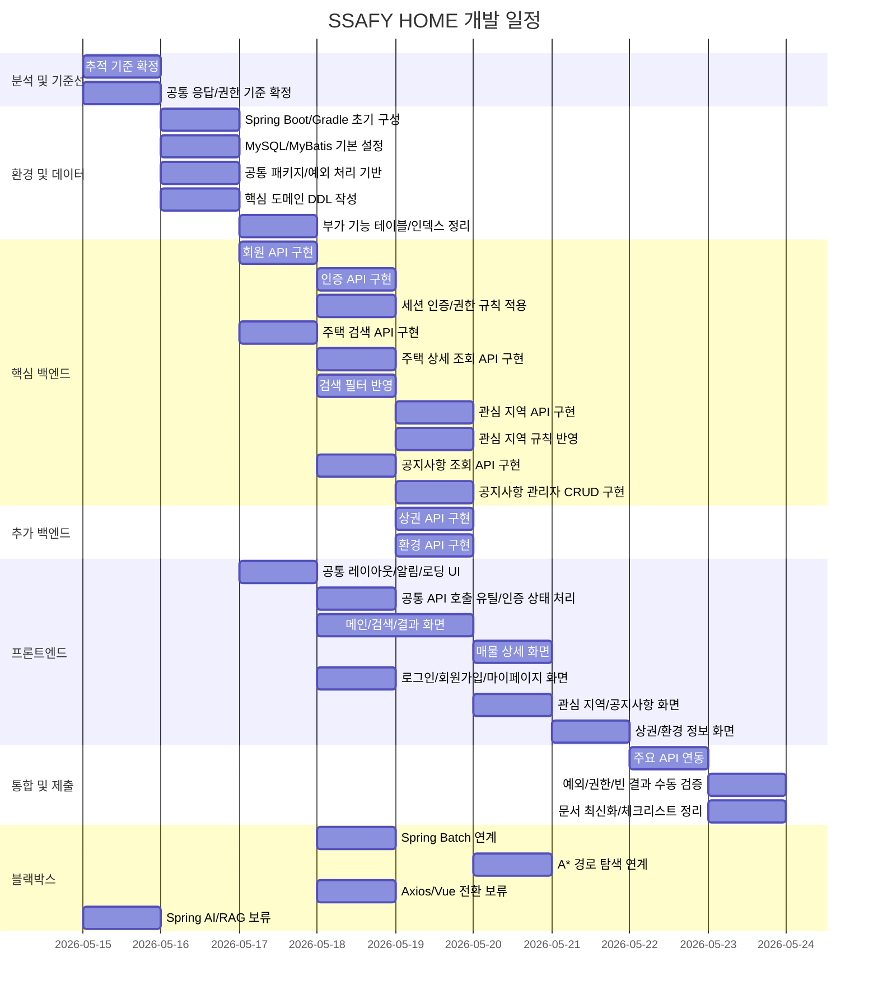

```mermaid
gantt
    title SSAFY HOME 개발 일정
    dateFormat  YYYY-MM-DD

    section 분석 및 기준선
    추적 기준 확정                  :a1, 2026-05-15, 1d
    공통 응답/권한 기준 확정         :a2, 2026-05-15, 1d

    section 환경 및 데이터
    Spring Boot/Gradle 초기 구성     :b1, 2026-05-16, 1d
    MySQL/MyBatis 기본 설정          :b2, 2026-05-16, 1d
    공통 패키지/예외 처리 기반       :b3, 2026-05-16, 1d
    핵심 도메인 DDL 작성             :b4, 2026-05-16, 1d
    부가 기능 테이블/인덱스 정리      :b5, 2026-05-17, 1d

    section 핵심 백엔드
    회원 API 구현                   :c1, 2026-05-17, 1d
    인증 API 구현                   :c2, 2026-05-18, 1d
    세션 인증/권한 규칙 적용         :c3, 2026-05-18, 1d
    주택 검색 API 구현              :c4, 2026-05-17, 1d
    주택 상세 조회 API 구현          :c5, 2026-05-18, 1d
    검색 필터 반영                  :c6, 2026-05-18, 1d
    관심 지역 API 구현              :c7, 2026-05-19, 1d
    관심 지역 규칙 반영             :c8, 2026-05-19, 1d
    공지사항 조회 API 구현          :c9, 2026-05-18, 1d
    공지사항 관리자 CRUD 구현        :c10, 2026-05-19, 1d

    section 추가 백엔드
    상권 API 구현                   :d1, 2026-05-19, 1d
    환경 API 구현                   :d2, 2026-05-19, 1d

    section 프론트엔드
    공통 레이아웃/알림/로딩 UI       :e1, 2026-05-17, 1d
    공통 API 호출 유틸/인증 상태 처리 :e2, 2026-05-18, 1d
    메인/검색/결과 화면             :e3, 2026-05-18, 2d
    매물 상세 화면                  :e4, 2026-05-20, 1d
    로그인/회원가입/마이페이지 화면  :e5, 2026-05-18, 1d
    관심 지역/공지사항 화면         :e6, 2026-05-20, 1d
    상권/환경 정보 화면             :e7, 2026-05-21, 1d

    section 통합 및 제출
    주요 API 연동                   :f1, 2026-05-22, 1d
    예외/권한/빈 결과 수동 검증      :f2, 2026-05-23, 1d
    문서 최신화/체크리스트 정리       :f3, 2026-05-23, 1d

    section 블랙박스
    Spring Batch 연계               :g1, 2026-05-18, 1d
    A* 경로 탐색 연계               :g2, 2026-05-20, 1d
    Axios/Vue 전환 보류             :g3, 2026-05-18, 1d
    Spring AI/RAG 보류              :g4, 2026-05-15, 1d
```
