# 화면설계서

- 프로젝트: 잘살아봐라마 (SSAFY HOME)
- 버전: 2.0
- 작성일: 2026-06-26
- 상태: 확정
- 대상: 사용자 웹 (frontend/)
- 관련 문서: [functional-requirements.md](./requirements-definition.md), [api-spec.md](./docs/05_api/api-spec.md)

---

## 1. 공통 컴포넌트

| 컴포넌트 | 적용 화면 | 설명 |
|---------|-----------|------|
| 내비게이션 바 | 전체 | 로고(홈 링크), 주요 메뉴(검색·커뮤니티·공지·Q&A·AI 채팅), 로그인/로그아웃 버튼, 로그인 시 사용자명 표시 |
| 알림 메시지 | 전체 | API 성공·오류·경고 결과를 화면 상단에 표시 |
| 로딩 인디케이터 | 전체 | API 응답 대기 중 스피너 표시 |

---

## 2. 화면 목록

| 화면 ID | 화면명 | URL 경로 | 접근 권한 | 관련 요구사항 | 관련 API |
|---------|--------|----------|-----------|--------------|---------|
| SCR-HOME | 메인 페이지 | `/` | 전체 | REQ-HOUSE-002 | GET /api/stats |
| SCR-SEARCH | 주택 검색 페이지 | `/search` | 전체 | REQ-HOUSE-002, REQ-HOUSE-003, REQ-HOUSE-004, REQ-HOUSE-005, REQ-ROUTE-001 | GET /api/houses, GET /api/regions, GET /api/routes |
| SCR-FAVORITE | 관심 지역 관리 페이지 | `/favorites` | 회원 | REQ-FAVORITE-001, REQ-FAVORITE-002, REQ-FAVORITE-003 | GET /api/favorites, POST /api/favorites, DELETE /api/favorites/{id} |
| SCR-COMMERCIAL | 상권 정보 페이지 | `/commercial` | 전체 | REQ-COMMERCIAL-001, REQ-COMMERCIAL-002 | GET /api/commercial |
| SCR-ENVIRONMENT | 환경 정보 페이지 | `/environment` | 전체 | REQ-ENV-001 | GET /api/environment |
| SCR-NOTICE-LIST | 공지사항 목록 페이지 | `/notices` | 전체 | REQ-NOTICE-001, REQ-NOTICE-005 | GET /api/notices, DELETE /api/notices/{id} |
| SCR-NOTICE-DETAIL | 공지사항 상세 페이지 | `/notices/:id` | 전체 | REQ-NOTICE-002, REQ-NOTICE-004, REQ-NOTICE-005 | GET /api/notices/{id}, PUT /api/notices/{id}, DELETE /api/notices/{id} |
| SCR-NOTICE-FORM | 공지사항 작성/수정 페이지 | (모달 또는 별도 경로) | 관리자 | REQ-NOTICE-003, REQ-NOTICE-004 | POST /api/notices, PUT /api/notices/{id} |
| SCR-BOARD-LIST | 커뮤니티 게시판 목록 | `/boards` | 전체 (작성은 회원) | - | GET /api/boards, DELETE /api/boards/{id} |
| SCR-BOARD-DETAIL | 게시글 상세 페이지 | `/boards/:id` | 전체 | - | GET /api/boards/{id} |
| SCR-BOARD-FORM | 게시글 작성/수정 페이지 | `/boards/new`, `/boards/:id/edit` | 회원 | - | POST /api/boards, PUT /api/boards/{id} |
| SCR-QNA-LIST | Q&A 목록 페이지 | `/qnas` | 전체 (작성은 회원) | - | GET /api/qnas, DELETE /api/qnas/{id} |
| SCR-QNA-DETAIL | Q&A 상세 페이지 | `/qnas/:id` | 전체 | - | GET /api/qnas/{id} |
| SCR-QNA-FORM | Q&A 작성/수정 페이지 | `/qnas/new`, `/qnas/:id/edit` | 회원 | - | POST /api/qnas, PUT /api/qnas/{id} |
| SCR-CHAT | AI 채팅 페이지 | `/chat` | 회원 | - | POST /api/chat, POST /api/chat/upload |
| SCR-REPORT | 배치 리포트 페이지 | `/reports/batch` | 회원 | REQ-HOUSE-001 | GET /api/reports/batch/latest, GET /api/reports/batch/{id}/pdf |
| SCR-LOGIN | 로그인 페이지 | `/login` | 비회원 | REQ-AUTH-001 | POST /api/auth/login |
| SCR-SIGNUP | 회원 가입 페이지 | `/signup` | 비회원 | REQ-MEMBER-001 | POST /api/members |
| SCR-PW-RECOVERY | 비밀번호 찾기 페이지 | `/password-recovery` | 전체 | - | - |
| SCR-PROFILE | 마이페이지 | `/profile` | 회원 | REQ-MEMBER-002, REQ-MEMBER-003, REQ-MEMBER-004 | GET /api/members/me, PUT /api/members/me, DELETE /api/members/me |

---

## 3. 화면 접근 권한

| 화면 ID | 비회원 | 회원 | 관리자 |
|---------|:------:|:----:|:------:|
| SCR-HOME | O | O | O |
| SCR-SEARCH | O | O | O |
| SCR-FAVORITE | X | O | O |
| SCR-COMMERCIAL | O | O | O |
| SCR-ENVIRONMENT | O | O | O |
| SCR-NOTICE-LIST | O | O | O |
| SCR-NOTICE-DETAIL | O | O | O |
| SCR-NOTICE-FORM | X | X | O |
| SCR-BOARD-LIST | O | O | O |
| SCR-BOARD-DETAIL | O | O | O |
| SCR-BOARD-FORM | X | O | O |
| SCR-QNA-LIST | O | O | O |
| SCR-QNA-DETAIL | O | O | O |
| SCR-QNA-FORM | X | O | O |
| SCR-CHAT | X | O | O |
| SCR-REPORT | X | O | O |
| SCR-LOGIN | O | X | X |
| SCR-SIGNUP | O | X | X |
| SCR-PW-RECOVERY | O | O | O |
| SCR-PROFILE | X | O | O |

> 비고: SCR-LOGIN·SCR-SIGNUP은 이미 로그인된 사용자가 접근하면 메인 페이지로 리다이렉트한다.

---

## 4. 대표 화면 이미지

> 캡처 기준: `frontend/` Vite 개발 서버, 데스크톱 1440x1200 뷰포트.

### SCR-HOME — 메인 페이지

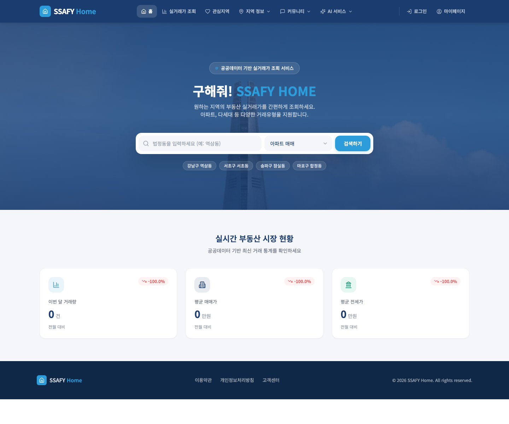

### SCR-SEARCH — 주택 검색 페이지

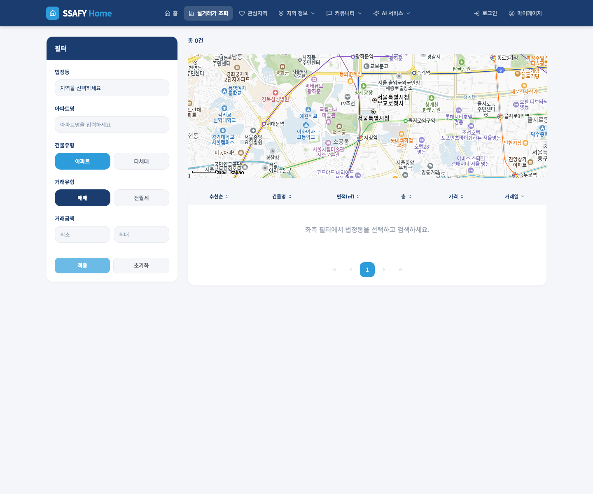

### SCR-COMMERCIAL — 상권 정보 페이지

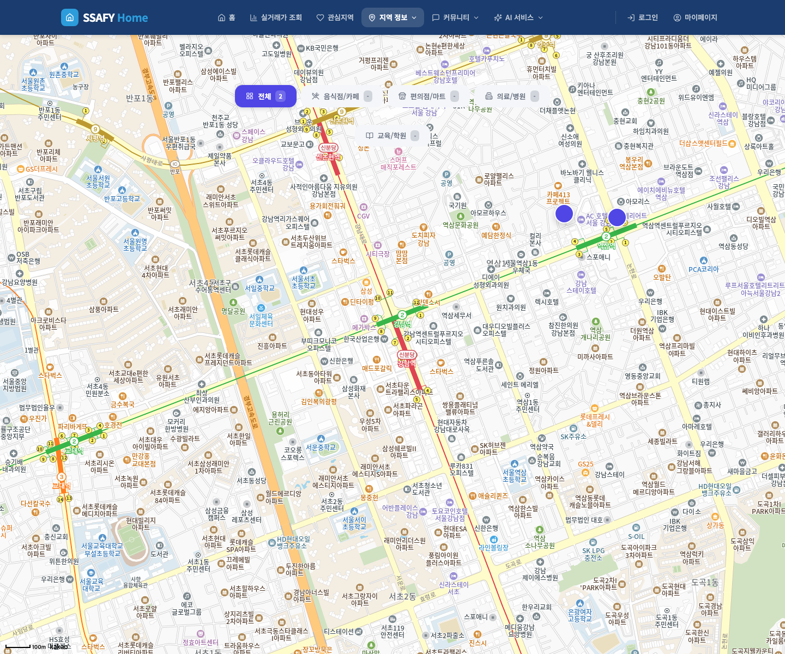

### SCR-ENVIRONMENT — 환경 정보 페이지

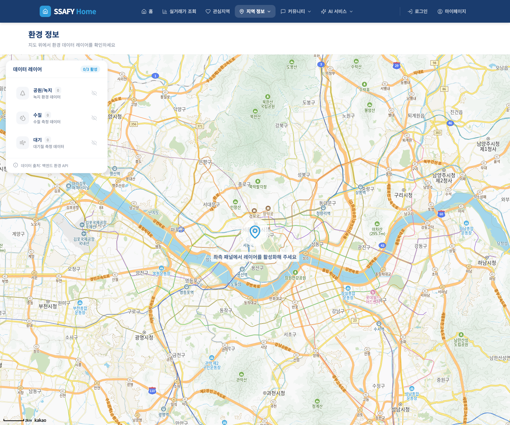

### SCR-NOTICE-LIST — 공지사항 목록 페이지

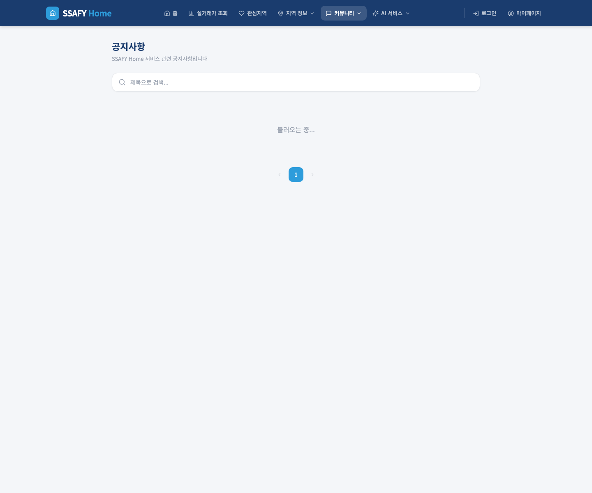

### SCR-BOARD-LIST — 커뮤니티 게시판 목록

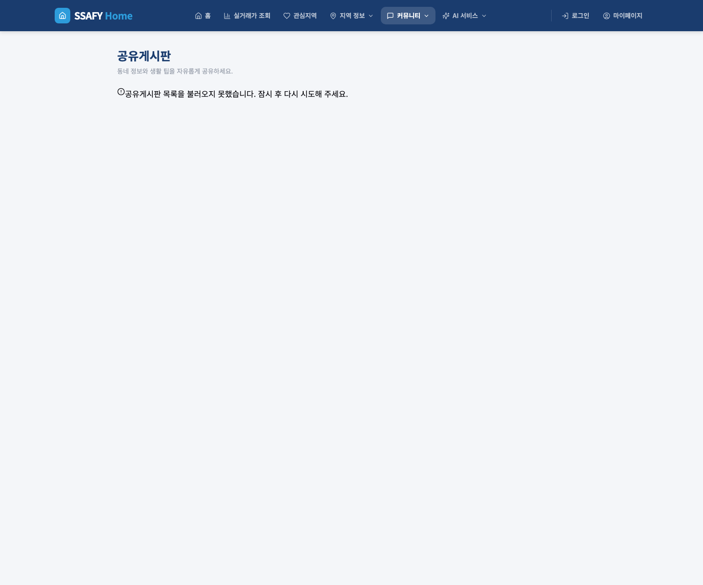

### SCR-QNA-LIST — Q&A 목록 페이지

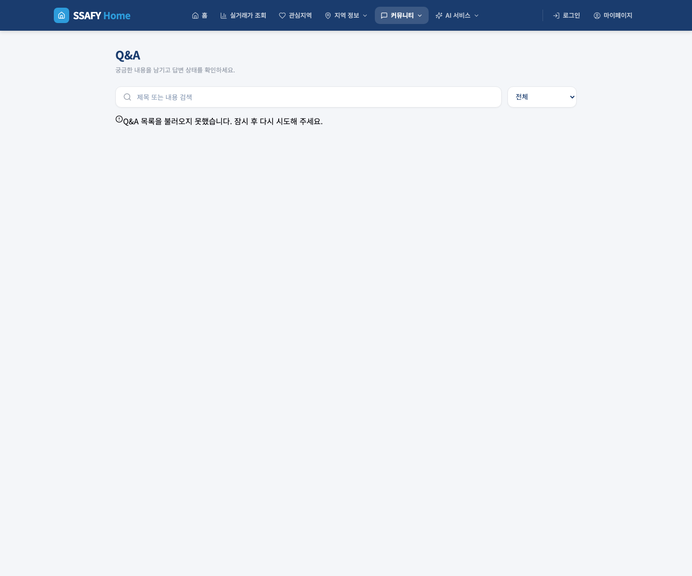

### SCR-LOGIN — 로그인 페이지

### SCR-SIGNUP — 회원 가입 페이지

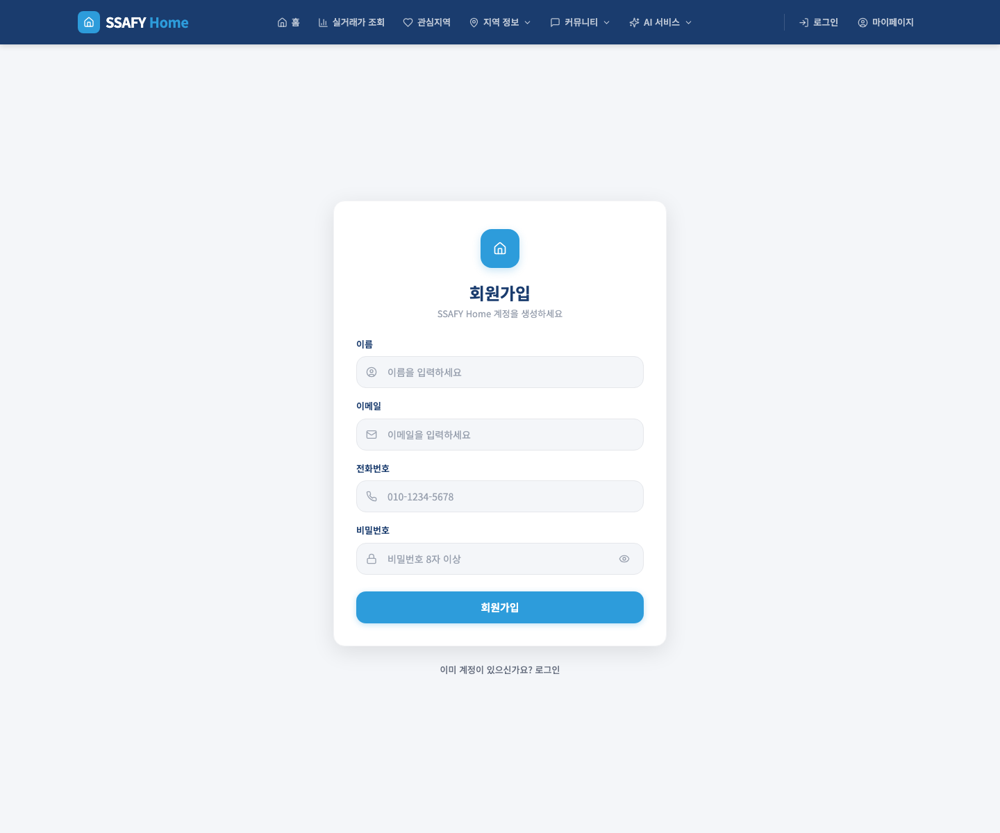

### SCR-PW-RECOVERY — 비밀번호 찾기 페이지

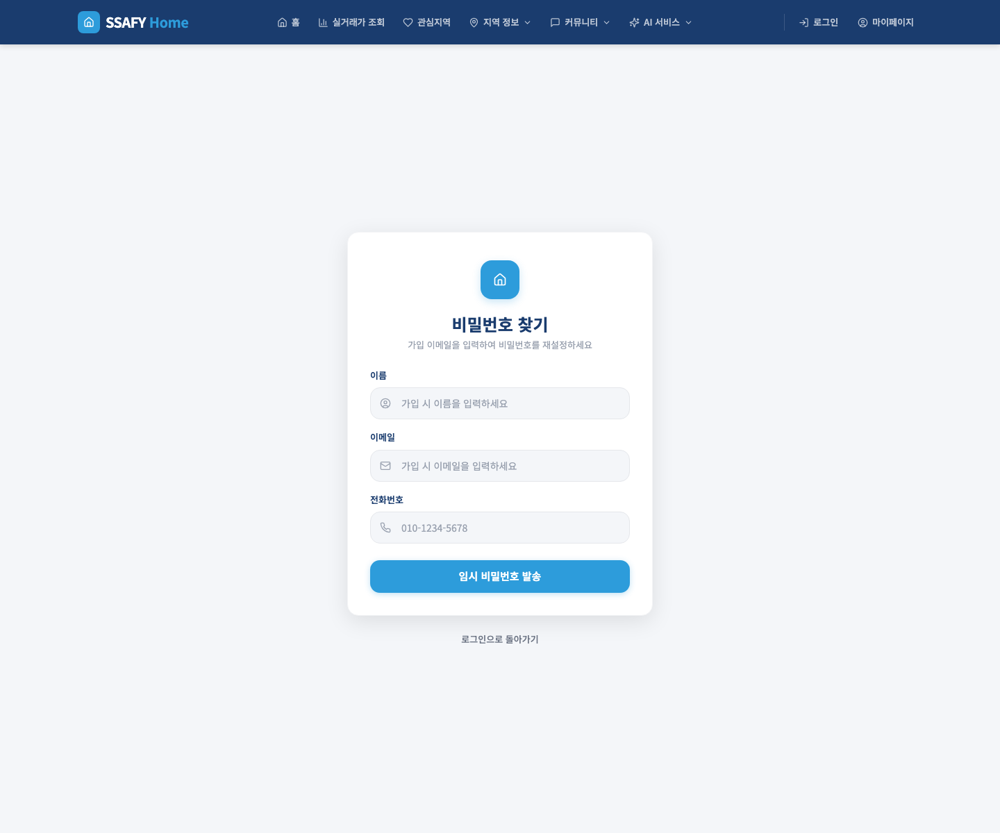

### 로그인 필요 화면 접근 시

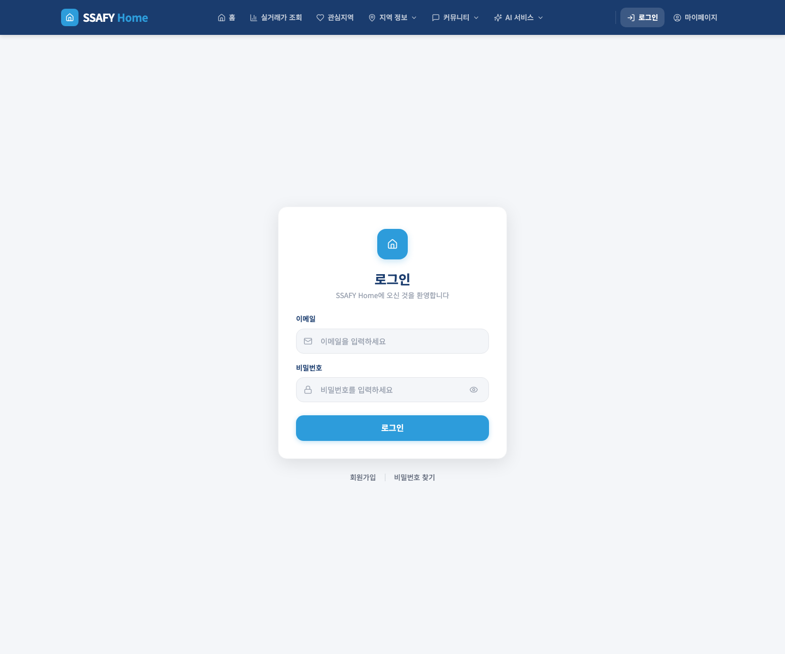

---

## 5. 화면별 상세 명세

---

### SCR-HOME — 메인 페이지

| 항목 | 내용 |
|------|------|
| URL | `/` |
| 접근 권한 | 전체 |
| 목적 | 서비스 진입점. 빠른 주택 검색과 부동산 시장 현황 요약 제공 |

**화면 이미지**

**주요 구성 요소**

- **Hero 섹션**: 서울 도심 배경 이미지 위에 검색 폼 배치
  - 법정동 입력 필드 (예: 역삼동)
  - 거래 유형 드롭다운 (아파트 매매 / 아파트 전월세 / 다세대 매매 / 다세대 전월세)
  - 검색하기 버튼 → `/search` 이동
  - 빠른 검색 태그: 역삼동·서초동·잠실동·합정동
- **시장 현황 카드** (3개): 이번 달 거래량, 평균 매매가, 평균 전세가 (전월 대비 등락률 표시)

**입/출력**

| 구분 | 항목 |
|------|------|
| 입력 | 법정동 텍스트, 거래 유형 선택 |
| 출력 | 시장 통계 카드 (GET /api/stats) |

---

### SCR-SEARCH — 주택 검색 페이지

| 항목 | 내용 |
|------|------|
| URL | `/search` |
| 접근 권한 | 전체 |
| 목적 | 시도·시군구·읍면동 및 아파트명 조건으로 주택 거래를 검색하고 결과와 상세 정보를 조회 |

**화면 이미지**

**주요 구성 요소**

- **검색 필터 사이드바** (토글 가능)
  - 지역 계층 선택: 시도 → 시군구 → 읍면동 (연동 드롭다운)
  - 건물 유형·거래 유형 선택
  - 거래 금액 범위 입력 (최소·최대, 만원 단위)
  - 검색 버튼
- **검색 결과 목록**: 페이지당 10건, 정렬 기준 변경(거래일·금액) 가능
  - 목록 항목: 아파트명, 면적, 층, 거래금액, 거래일
  - 항목 클릭 시 상세 모달 열기
  - 관심 지역 하트 버튼 (로그인 시 활성화)
- **매물 상세 모달** (지도 포함)
  - 주택 정보: 이름, 위치, 건축연도, 면적, 층
  - 거래 이력 목록
  - 경로 탐색 패널 (RoutePanel): 로그인 사용자만 사용 가능. 목적지 입력 후 A* 경로 계산 결과(총 거리·예상 시간)와 지도 경로 표시
- **빈 결과 안내**: 검색 조건에 맞는 거래가 없으면 안내 문구 표시

**입/출력**

| 구분 | 항목 |
|------|------|
| 입력 | 지역 코드, 건물 유형, 거래 유형, 금액 범위, 정렬 기준, 페이지 번호 |
| 출력 | 거래 목록, 페이지네이션, 매물 상세 정보, A* 경로 |

**접근 규칙**

- 경로 탐색 패널은 로그인 사용자만 사용할 수 있다.
- 비회원이 경로 탐색을 시도하면 로그인 유도 메시지를 표시한다.

---

### SCR-FAVORITE — 관심 지역 관리 페이지

| 항목 | 내용 |
|------|------|
| URL | `/favorites` |
| 접근 권한 | 회원 (미로그인 시 `/login` 리다이렉트) |
| 목적 | 관심 지역 등록·조회·삭제 |

**주요 구성 요소**

- 관심 지역 목록 (행정구역명, 등록일)
- 지역 선택 후 추가 버튼
- 삭제 버튼 (목록 항목별)
- 중복 등록 시 오류 메시지 표시

**입/출력**

| 구분 | 항목 |
|------|------|
| 입력 | 행정구역 선택 |
| 출력 | 관심 지역 목록 |

---

### SCR-COMMERCIAL — 상권 정보 페이지

| 항목 | 내용 |
|------|------|
| URL | `/commercial` |
| 접근 권한 | 전체 |
| 목적 | 위치 주변 상업 시설 조회 및 업종별 필터 |

**화면 이미지**

**주요 구성 요소**

- 위치 입력 (위도·경도 또는 주소)
- 업종 필터 (음식점·편의점·병원 등)
- 상업 시설 목록 (업종, 상호명, 거리)
- 지도 마커 표시 (Kakao Maps)

**입/출력**

| 구분 | 항목 |
|------|------|
| 입력 | 위도, 경도, 업종 필터 |
| 출력 | 상업 시설 목록, 지도 마커 |

---

### SCR-ENVIRONMENT — 환경 정보 페이지

| 항목 | 내용 |
|------|------|
| URL | `/environment` |
| 접근 권한 | 전체 |
| 목적 | 서울 열린데이터 기반 주변 환경 점검 정보 조회 |

**화면 이미지**

**주요 구성 요소**

- 위치 입력
- 환경 정보 목록 (항목명, 수치, 점검일)

**입/출력**

| 구분 | 항목 |
|------|------|
| 입력 | 위도, 경도 |
| 출력 | 환경 점검 데이터 목록 |

---

### SCR-NOTICE-LIST — 공지사항 목록 페이지

| 항목 | 내용 |
|------|------|
| URL | `/notices` |
| 접근 권한 | 전체 |
| 목적 | 공지사항 목록 조회 및 관리자 작성 진입 |

**화면 이미지**

**주요 구성 요소**

- 공지사항 목록 (제목, 작성일, 작성자)
- 공지사항 항목 클릭 → SCR-NOTICE-DETAIL 이동
- 관리자 전용: 공지 작성 버튼 표시

**입/출력**

| 구분 | 항목 |
|------|------|
| 입력 | 없음 |
| 출력 | 공지사항 목록 |

---

### SCR-NOTICE-DETAIL — 공지사항 상세 페이지

| 항목 | 내용 |
|------|------|
| URL | `/notices/:id` |
| 접근 권한 | 전체 |
| 목적 | 특정 공지사항 상세 내용 조회 |

**주요 구성 요소**

- 제목, 내용, 작성자, 작성일
- 관리자 전용: 수정·삭제 버튼

**입/출력**

| 구분 | 항목 |
|------|------|
| 입력 | 없음 (URL 파라미터: id) |
| 출력 | 공지사항 상세 내용 |

---

### SCR-NOTICE-FORM — 공지사항 작성/수정 페이지

| 항목 | 내용 |
|------|------|
| URL | 모달 또는 별도 경로 (관리자만 진입) |
| 접근 권한 | 관리자 |
| 목적 | 공지사항 등록 및 수정 |

**주요 구성 요소**

- 제목 입력 필드
- 내용 입력 필드 (텍스트 에어리어)
- 저장 버튼 → 목록 이동
- 취소 버튼

**입/출력**

| 구분 | 항목 |
|------|------|
| 입력 | 제목, 내용 |
| 출력 | 저장 결과 메시지 |

---

### SCR-BOARD-LIST — 커뮤니티 게시판 목록

| 항목 | 내용 |
|------|------|
| URL | `/boards` |
| 접근 권한 | 전체 (작성·삭제는 회원/관리자) |
| 목적 | 커뮤니티 게시글 목록 조회 |

**화면 이미지**

**주요 구성 요소**

- 게시글 목록 (제목, 작성자, 작성일, 댓글 수)
- 페이지네이션 (10건/페이지)
- 회원 전용: 글쓰기 버튼 → SCR-BOARD-FORM
- 작성자/관리자 전용: 목록에서 삭제 버튼

**입/출력**

| 구분 | 항목 |
|------|------|
| 입력 | 페이지 번호 |
| 출력 | 게시글 목록, 페이지네이션 |

---

### SCR-BOARD-DETAIL — 게시글 상세 페이지

| 항목 | 내용 |
|------|------|
| URL | `/boards/:id` |
| 접근 권한 | 전체 |
| 목적 | 게시글 내용 조회 |

**주요 구성 요소**

- 제목, 내용, 작성자, 작성일
- 작성자/관리자 전용: 수정·삭제 버튼

**입/출력**

| 구분 | 항목 |
|------|------|
| 입력 | 없음 (URL 파라미터: id) |
| 출력 | 게시글 상세 내용 |

---

### SCR-BOARD-FORM — 게시글 작성/수정 페이지

| 항목 | 내용 |
|------|------|
| URL | `/boards/new` (작성), `/boards/:id/edit` (수정) |
| 접근 권한 | 회원 (미로그인 시 `/login` 리다이렉트) |
| 목적 | 게시글 등록 및 수정 |

**주요 구성 요소**

- 제목 입력 필드
- 내용 입력 필드 (텍스트 에어리어)
- 저장 버튼 → 상세 페이지 이동
- 취소 버튼 → 이전 화면 이동

**입/출력**

| 구분 | 항목 |
|------|------|
| 입력 | 제목, 내용 |
| 출력 | 저장 결과 메시지 |

---

### SCR-QNA-LIST — Q&A 목록 페이지

| 항목 | 내용 |
|------|------|
| URL | `/qnas` |
| 접근 권한 | 전체 (작성은 회원) |
| 목적 | Q&A 목록 조회 |

**화면 이미지**

**주요 구성 요소**

- Q&A 목록 (제목, 작성자, 작성일)
- 페이지네이션
- 회원 전용: 질문 작성 버튼

**입/출력**

| 구분 | 항목 |
|------|------|
| 입력 | 페이지 번호 |
| 출력 | Q&A 목록 |

---

### SCR-QNA-DETAIL — Q&A 상세 페이지

| 항목 | 내용 |
|------|------|
| URL | `/qnas/:id` |
| 접근 권한 | 전체 |
| 목적 | Q&A 질문과 답변 조회 |

**주요 구성 요소**

- 질문 제목, 내용, 작성자, 작성일
- 답변 내용 (있는 경우)
- 작성자/관리자 전용: 수정·삭제 버튼

**입/출력**

| 구분 | 항목 |
|------|------|
| 입력 | 없음 (URL 파라미터: id) |
| 출력 | Q&A 상세 내용 |

---

### SCR-QNA-FORM — Q&A 작성/수정 페이지

| 항목 | 내용 |
|------|------|
| URL | `/qnas/new` (작성), `/qnas/:id/edit` (수정) |
| 접근 권한 | 회원 (미로그인 시 `/login` 리다이렉트) |
| 목적 | Q&A 등록 및 수정 |

**주요 구성 요소**

- 제목 입력 필드
- 내용 입력 필드 (텍스트 에어리어)
- 저장 버튼 → 상세 페이지 이동
- 취소 버튼

**입/출력**

| 구분 | 항목 |
|------|------|
| 입력 | 제목, 내용 |
| 출력 | 저장 결과 메시지 |

---

### SCR-CHAT — AI 채팅 페이지

| 항목 | 내용 |
|------|------|
| URL | `/chat` |
| 접근 권한 | 회원 (미로그인 시 `/login` 리다이렉트) |
| 목적 | SSAFY Home 데이터 기반 AI 채팅 및 RAG 문서 업로드 |

**화면 이미지**

**주요 구성 요소**

- **헤더**: AI 채팅 타이틀, "로그인 전용" 뱃지
- **메시지 영역**: 대화 메시지 목록 (사용자/AI 말풍선 구분)
  - 초기 안내 메시지: "관심 지역, 실거래가, 주거 환경에 대해 질문해 주세요."
  - AI 응답에 RAG 사용 여부 뱃지("문서 기반") 표시
  - AI 응답 생성 중 스피너 표시
- **입력 영역**
  - 문서 첨부 버튼 (.txt / .md / .pdf 허용) — 업로드 중 스피너, 완료 시 체크 아이콘
  - 메시지 입력 텍스트 에어리어 (Enter 전송, Shift+Enter 줄바꿈)
  - 전송 버튼
- **오류 메시지**: API 실패 시 입력 영역 상단에 인라인 표시

**입/출력**

| 구분 | 항목 |
|------|------|
| 입력 | 질문 텍스트, 첨부 파일 (.txt/.md/.pdf) |
| 출력 | AI 답변 텍스트, RAG 사용 여부 표시 |

**동작 규칙**

- 문서 업로드는 채팅과 독립적으로 동작한다. 업로드 성공 시 3초간 완료 아이콘을 표시한다.
- 메시지 전송 중에는 입력 필드와 버튼이 비활성화된다.
- 새 메시지가 추가되면 자동으로 최신 메시지로 스크롤한다.

---

### SCR-REPORT — 배치 리포트 페이지

| 항목 | 내용 |
|------|------|
| URL | `/reports/batch` |
| 접근 권한 | 회원 (미로그인 시 `/login` 리다이렉트) |
| 목적 | AI 생성 배치 처리 결과 리포트 조회 및 PDF 다운로드 |

**화면 이미지**

**주요 구성 요소**

- 최신 배치 리포트 내용 표시
- PDF 다운로드 버튼 (`/api/reports/batch/{id}/pdf`)

**입/출력**

| 구분 | 항목 |
|------|------|
| 입력 | 없음 (최신 리포트 자동 로드) |
| 출력 | 배치 리포트 내용, PDF 다운로드 링크 |

---

### SCR-LOGIN — 로그인 페이지

| 항목 | 내용 |
|------|------|
| URL | `/login` |
| 접근 권한 | 비회원 (로그인 시 메인 페이지 리다이렉트) |
| 목적 | 이메일·비밀번호 로그인 |

**화면 이미지**

**주요 구성 요소**

- 이메일 입력 필드
- 비밀번호 입력 필드
- 로그인 버튼
- 회원가입 페이지 링크
- 비밀번호 찾기 링크 → SCR-PW-RECOVERY

**입/출력**

| 구분 | 항목 |
|------|------|
| 입력 | 이메일, 비밀번호 |
| 출력 | 로그인 결과 (성공 시 메인 또는 이전 페이지 이동) |

---

### SCR-SIGNUP — 회원 가입 페이지

| 항목 | 내용 |
|------|------|
| URL | `/signup` |
| 접근 권한 | 비회원 (로그인 시 메인 페이지 리다이렉트) |
| 목적 | 신규 회원 등록 |

**화면 이미지**

**주요 구성 요소**

- 이메일 입력 필드
- 비밀번호 입력 필드
- 이름 입력 필드
- 가입 버튼
- 로그인 페이지 링크

**입/출력**

| 구분 | 항목 |
|------|------|
| 입력 | 이메일, 비밀번호, 이름 |
| 출력 | 가입 완료 메시지 (성공 시 로그인 페이지 이동) |

---

### SCR-PW-RECOVERY — 비밀번호 찾기 페이지

| 항목 | 내용 |
|------|------|
| URL | `/password-recovery` |
| 접근 권한 | 전체 |
| 목적 | 비밀번호 재설정 안내 |

**화면 이미지**

**주요 구성 요소**

- 이메일 입력 필드
- 비밀번호 재설정 요청 버튼

**입/출력**

| 구분 | 항목 |
|------|------|
| 입력 | 이메일 |
| 출력 | 재설정 안내 메시지 |

---

### SCR-PROFILE — 마이페이지

| 항목 | 내용 |
|------|------|
| URL | `/profile` |
| 접근 권한 | 회원 (미로그인 시 `/login` 리다이렉트) |
| 목적 | 회원 정보 조회·수정·탈퇴 |

**화면 이미지**

**주요 구성 요소**

- 현재 회원 정보 표시 (이름, 이메일)
- 이름·비밀번호 수정 폼
- 저장 버튼
- 회원 탈퇴 버튼 (확인 다이얼로그 포함)

**입/출력**

| 구분 | 항목 |
|------|------|
| 입력 | 이름, 비밀번호 (수정 시) |
| 출력 | 현재 회원 정보, 수정·탈퇴 결과 메시지 |

---

## 6. 화면 전환 흐름

### 전체 흐름

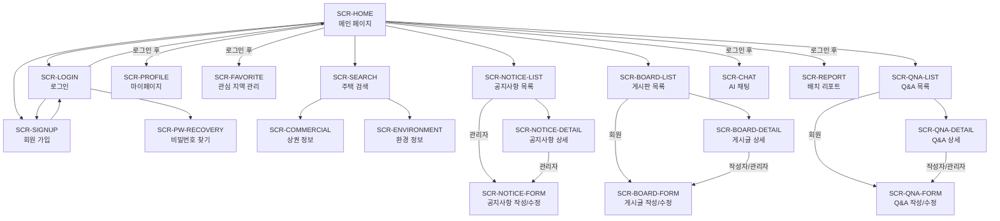

### 비회원 주요 흐름

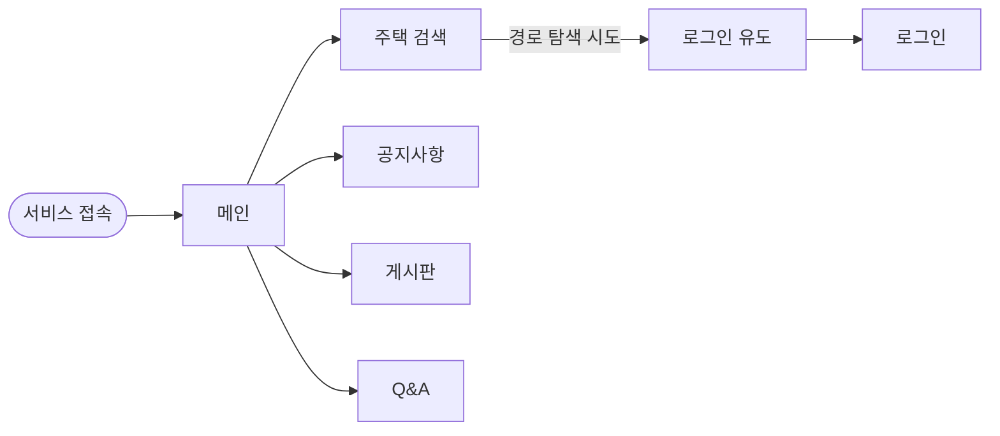

### 회원 주요 흐름

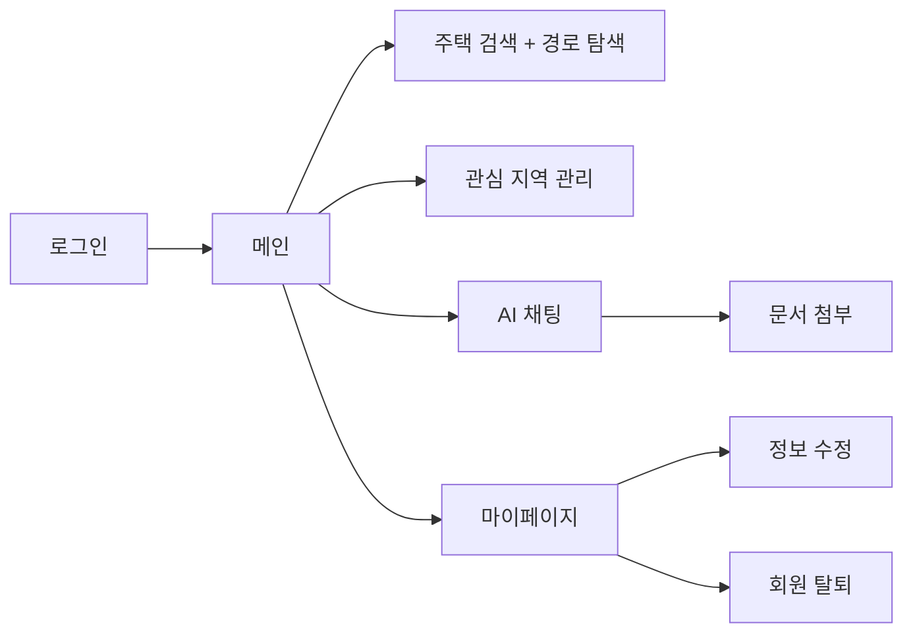
