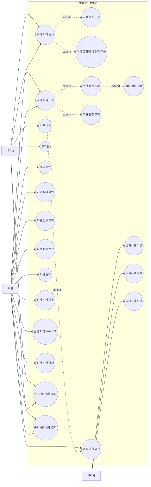

```mermaid
flowchart LR
    Guest[비회원]
    Member[회원]
    Admin[관리자]

    subgraph System[SSAFY HOME]
        UC_HOUSE_001((주택 거래 검색))
        UC_HOUSE_002((거래 목록 조회))
        UC_HOUSE_003((주택 상세 조회))
        UC_HOUSE_004((거래 유형/금액 필터 적용))

        UC_AUTH_001((회원 가입))
        UC_AUTH_002((로그인))
        UC_AUTH_003((로그아웃))
        UC_AUTH_004((인증 상태 확인))

        UC_MEMBER_001((회원 정보 조회))
        UC_MEMBER_002((회원 정보 수정))
        UC_MEMBER_003((회원 탈퇴))

        UC_FAV_001((관심 지역 등록))
        UC_FAV_002((관심 지역 목록 조회))
        UC_FAV_003((관심 지역 삭제))

        UC_COMMERCIAL_001((주변 상권 조회))
        UC_COMMERCIAL_002((업종 필터 적용))
        UC_ENV_001((주변 환경 조회))
        UC_ROUTE_001((경로 탐색 요청))

        UC_NOTICE_001((공지사항 목록 조회))
        UC_NOTICE_002((공지사항 상세 조회))
        UC_NOTICE_003((공지사항 작성))
        UC_NOTICE_004((공지사항 수정))
        UC_NOTICE_005((공지사항 삭제))
    end

    Guest --> UC_HOUSE_001
    Guest --> UC_HOUSE_003
    Guest --> UC_AUTH_001
    Guest --> UC_AUTH_002
    Guest --> UC_NOTICE_001
    Guest --> UC_NOTICE_002

    Member --> UC_HOUSE_001
    Member --> UC_HOUSE_003
    Member --> UC_AUTH_003
    Member --> UC_AUTH_004
    Member --> UC_MEMBER_001
    Member --> UC_MEMBER_002
    Member --> UC_MEMBER_003
    Member --> UC_FAV_001
    Member --> UC_FAV_002
    Member --> UC_FAV_003
    Member --> UC_ROUTE_001
    Member --> UC_NOTICE_001
    Member --> UC_NOTICE_002

    Admin --> UC_NOTICE_003
    Admin --> UC_NOTICE_004
    Admin --> UC_NOTICE_005

    UC_HOUSE_001 -. include .-> UC_HOUSE_002
    UC_HOUSE_001 -. extend .-> UC_HOUSE_004
    UC_HOUSE_003 -. extend .-> UC_COMMERCIAL_001
    UC_COMMERCIAL_001 -. extend .-> UC_COMMERCIAL_002
    UC_HOUSE_003 -. extend .-> UC_ENV_001
    UC_HOUSE_003 -. extend .-> UC_ROUTE_001
```
