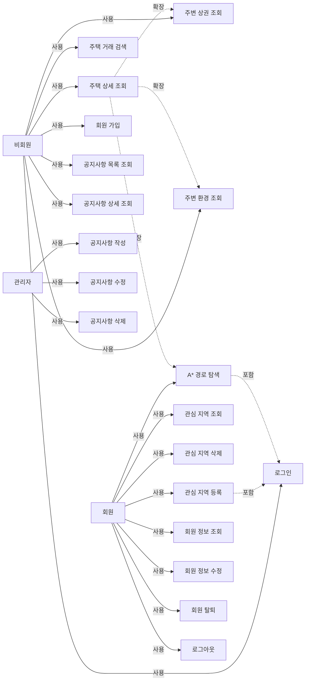

# 유스케이스 다이어그램

- 상태: 초안
- 작성자:
- 마지막 수정일: 2026-05-14
- 관련 요구사항: 전체
- 관련 문서: [domain-overview.md](domain-overview.md), [user-scenarios.md](user-scenarios.md), [../01_requirements/functional-requirements.md](../01_requirements/functional-requirements.md)

---

## 액터 정의

| 액터 | 설명 |
|------|------|
| 비회원 | 로그인하지 않은 방문자. 검색·조회 기능만 사용 가능 |
| 회원 | 로그인한 사용자. 비회원 기능 + 관심 지역, 경로 탐색, 마이페이지 사용 가능 |
| 관리자 | 회원 권한 + 공지사항 작성·수정·삭제 가능. 역할 구분 방식은 미정 |

비회원 ← 회원 관계: 회원은 비회원의 모든 유스케이스를 포함한다.

---

## 유스케이스 목록

### 주택 도메인

| UC ID | 유스케이스명 | 액터 | 포함/확장 관계 |
|-------|-------------|------|---------------|
| UC-HOUSE-001 | 주택 거래 검색 | 비회원, 회원 | UC-HOUSE-002를 포함 |
| UC-HOUSE-002 | 거래 목록 조회 | 비회원, 회원 | — |
| UC-HOUSE-003 | 주택 상세 조회 | 비회원, 회원 | UC-COMMERCIAL-001, UC-ENV-001, UC-ROUTE-001 확장 |

### 회원/인증 도메인

| UC ID | 유스케이스명 | 액터 | 포함/확장 관계 |
|-------|-------------|------|---------------|
| UC-AUTH-001 | 회원 가입 | 비회원 | — |
| UC-AUTH-002 | 로그인 | 비회원 | — |
| UC-AUTH-003 | 로그아웃 | 회원 | — |
| UC-MEMBER-001 | 회원 정보 조회 | 회원 | — |
| UC-MEMBER-002 | 회원 정보 수정 | 회원 | — |
| UC-MEMBER-003 | 회원 탈퇴 | 회원 | — |

### 관심 지역 도메인

| UC ID | 유스케이스명 | 액터 | 포함/확장 관계 |
|-------|-------------|------|---------------|
| UC-FAV-001 | 관심 지역 등록 | 회원 | UC-AUTH-002 포함 (로그인 필요) |
| UC-FAV-002 | 관심 지역 목록 조회 | 회원 | — |
| UC-FAV-003 | 관심 지역 삭제 | 회원 | — |

### 상권/환경 도메인

| UC ID | 유스케이스명 | 액터 | 포함/확장 관계 |
|-------|-------------|------|---------------|
| UC-COMMERCIAL-001 | 주변 상권 조회 | 비회원, 회원 | UC-HOUSE-003에서 확장 |
| UC-ENV-001 | 주변 환경 조회 | 비회원, 회원 | UC-HOUSE-003에서 확장 |

### 경로 도메인

| UC ID | 유스케이스명 | 액터 | 포함/확장 관계 |
|-------|-------------|------|---------------|
| UC-ROUTE-001 | A* 경로 탐색 | 회원 | UC-HOUSE-003에서 확장. UC-AUTH-002 포함 |

### 공지사항 도메인

| UC ID | 유스케이스명 | 액터 | 포함/확장 관계 |
|-------|-------------|------|---------------|
| UC-NOTICE-001 | 공지사항 목록 조회 | 비회원, 회원 | — |
| UC-NOTICE-002 | 공지사항 상세 조회 | 비회원, 회원 | — |
| UC-NOTICE-003 | 공지사항 작성 | 관리자 | — |
| UC-NOTICE-004 | 공지사항 수정 | 관리자 | — |
| UC-NOTICE-005 | 공지사항 삭제 | 관리자 | — |

---

## Mermaid 유스케이스 표현

유스케이스 다이어그램의 1차 문서화는 Mermaid를 기준으로 한다. 아래는 관계 구조를 나타내는 flowchart 형태의 문서 기준본이다. 이후 필요하면 draw.io 등으로 시각 정제한 PNG를 추가한다.

---

## 다이어그램 작성 가이드

1. **문서 기준**: Markdown 내 Mermaid 다이어그램을 기준 소스로 유지한다.
2. **저장 위치**: 정제된 이미지는 `assets/diagrams/usecase-YYYYMMDD.png`에 저장한다.
3. **포함 관계 (include)**: 점선 화살표에 `<<include>>` 스테레오타입을 표시한다.
4. **확장 관계 (extend)**: 점선 화살표에 `<<extend>>` 스테레오타입을 표시한다.
5. **액터 상속**: 비회원 → 회원 → 관리자 순으로 권한이 누적됨을 상속 화살표로 표현한다.
6. **경계**: 시스템 경계 박스(System Boundary)를 사용해 SSAFY HOME 서비스 범위를 명시한다.
