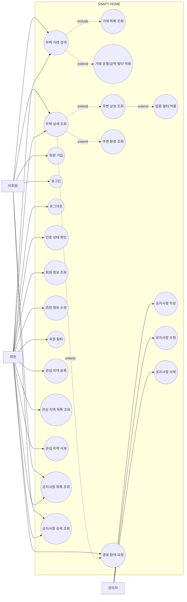

# 유스케이스 다이어그램

- 상태: 완료
- 작성자:
- 마지막 수정일: 2026-05-15
- 관련 요구사항: 전체
- 관련 문서: [domain-overview.md](domain-overview.md), [user-scenarios.md](user-scenarios.md), [../01_requirements/functional-requirements.md](../01_requirements/functional-requirements.md)

---

## 액터 정의

| 액터 | 설명 |
|------|------|
| 비회원 | 로그인하지 않은 방문자 |
| 회원 | 로그인한 사용자 |
| 관리자 | 회원 권한과 공지사항 관리 권한을 가진 사용자 |

---

## 유스케이스 목록

| UC ID | 유스케이스명 | 액터 | 관련 요구사항 |
|-------|-------------|------|---------------|
| UC-HOUSE-001 | 주택 거래 검색 | 비회원, 회원 | REQ-HOUSE-002 |
| UC-HOUSE-002 | 거래 목록 조회 | 비회원, 회원 | REQ-HOUSE-002 |
| UC-HOUSE-003 | 주택 상세 조회 | 비회원, 회원 | REQ-HOUSE-003 |
| UC-HOUSE-004 | 거래 유형/금액 필터 적용 | 비회원, 회원 | REQ-HOUSE-004, REQ-HOUSE-005 |
| UC-AUTH-001 | 회원 가입 | 비회원 | REQ-MEMBER-001 |
| UC-AUTH-002 | 로그인 | 비회원 | REQ-AUTH-001 |
| UC-AUTH-003 | 로그아웃 | 회원 | REQ-AUTH-002 |
| UC-AUTH-004 | 인증 상태 확인 | 회원 | REQ-AUTH-003 |
| UC-MEMBER-001 | 회원 정보 조회 | 회원 | REQ-MEMBER-002 |
| UC-MEMBER-002 | 회원 정보 수정 | 회원 | REQ-MEMBER-003 |
| UC-MEMBER-003 | 회원 탈퇴 | 회원 | REQ-MEMBER-004 |
| UC-FAV-001 | 관심 지역 등록 | 회원 | REQ-FAVORITE-001 |
| UC-FAV-002 | 관심 지역 목록 조회 | 회원 | REQ-FAVORITE-002 |
| UC-FAV-003 | 관심 지역 삭제 | 회원 | REQ-FAVORITE-003 |
| UC-COMMERCIAL-001 | 주변 상권 조회 | 비회원, 회원 | REQ-COMMERCIAL-001 |
| UC-COMMERCIAL-002 | 업종 필터 적용 | 비회원, 회원 | REQ-COMMERCIAL-002 |
| UC-ENV-001 | 주변 환경 조회 | 비회원, 회원 | REQ-ENV-001 |
| UC-ROUTE-001 | 경로 탐색 요청 | 회원 | REQ-ROUTE-001 |
| UC-NOTICE-001 | 공지사항 목록 조회 | 비회원, 회원 | REQ-NOTICE-001 |
| UC-NOTICE-002 | 공지사항 상세 조회 | 비회원, 회원 | REQ-NOTICE-002 |
| UC-NOTICE-003 | 공지사항 작성 | 관리자 | REQ-NOTICE-003 |
| UC-NOTICE-004 | 공지사항 수정 | 관리자 | REQ-NOTICE-004 |
| UC-NOTICE-005 | 공지사항 삭제 | 관리자 | REQ-NOTICE-005 |

---

## Mermaid 유스케이스 다이어그램

