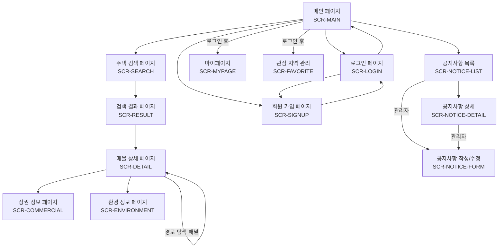
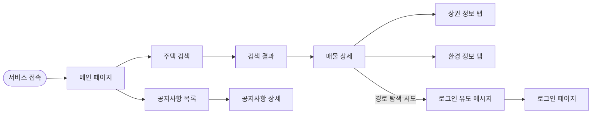
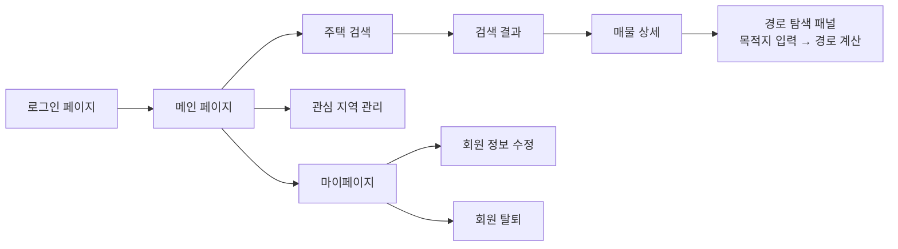
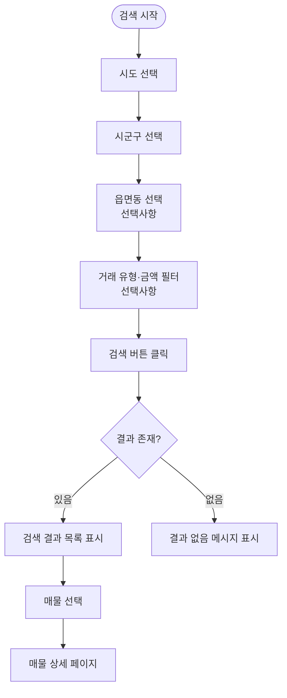
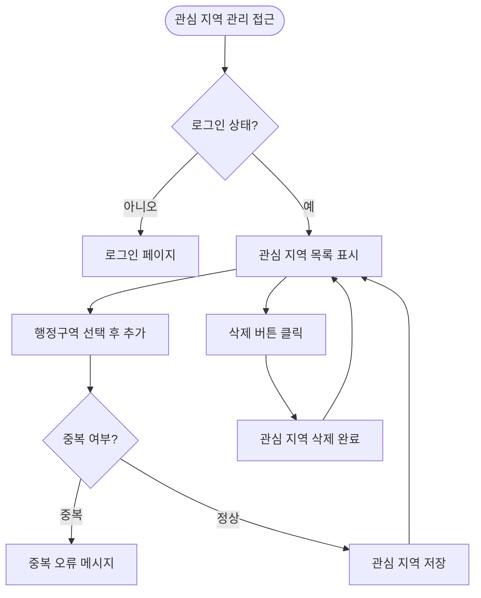
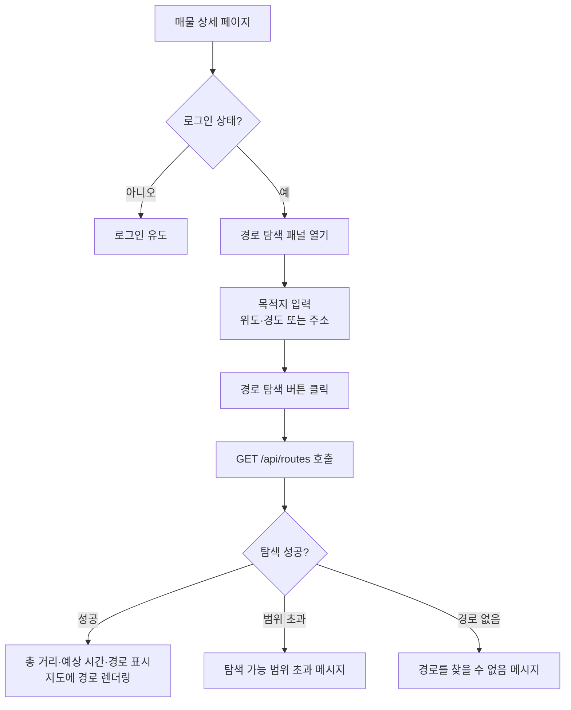
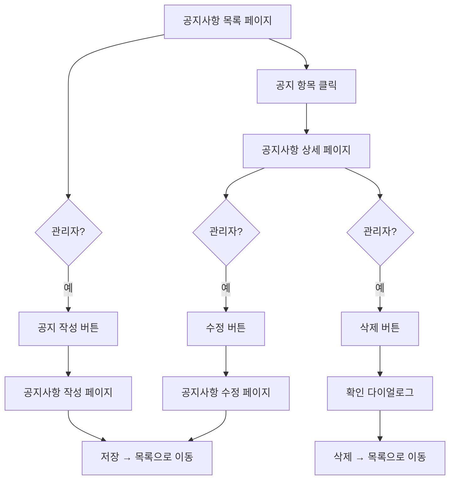

# 화면 흐름

- 상태: 초안
- 작성자:
- 마지막 수정일: 2026-05-14
- 관련 요구사항: REQ-HOUSE-002, REQ-AUTH-001, REQ-FAVORITE-001, REQ-ROUTE-001, REQ-NOTICE-001
- 관련 문서: [screen-list.md](screen-list.md), [wireframe.md](wireframe.md)

---

## 전체 화면 전환 흐름

---

## 프론트엔드 구성 원칙

- 현재 화면 흐름은 HTML/CSS/JavaScript 기준으로 설계한다.
- 백엔드는 REST API만 제공하고 서버 측 페이지 렌더링에 의존하지 않는다.
- 향후 Vue.js 전환 시에도 동일한 화면 ID와 흐름을 Vue Router 구조로 옮길 수 있도록 설계한다.
- 관리자 배치 운영 화면은 향후 확장 범위이며 현재 사용자 화면 흐름에는 포함하지 않는다.

---

## 비회원 사용자 흐름

비회원은 검색, 조회, 공지사항 열람만 가능하다. 회원 전용 기능에 접근하면 로그인 페이지로 이동한다.

---

## 회원 사용자 흐름

---

## 주택 검색 흐름

---

## 관심 지역 흐름

---

## A* 경로 탐색 흐름

---

## 공지사항 흐름

