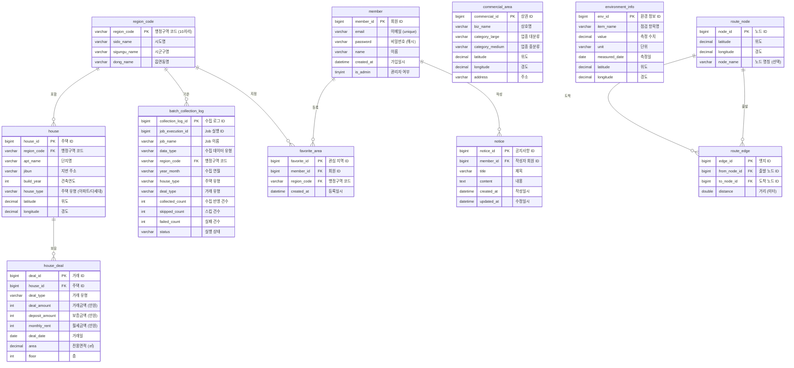

# ERD

- 상태: 초안
- 작성자:
- 마지막 수정일: 2026-05-14
- 관련 요구사항: REQ-HOUSE-001, REQ-HOUSE-002, REQ-HOUSE-003, REQ-MEMBER-001, REQ-FAVORITE-001, REQ-COMMERCIAL-001, REQ-ENV-001, REQ-ROUTE-001, REQ-NOTICE-001
- 관련 문서: [table-spec.md](table-spec.md), [schema.sql](schema.sql), [data-source.md](data-source.md)

---

## 주요 엔티티 목록

| 엔티티 | 테이블명 | 설명 |
|--------|----------|------|
| 행정구역 | region_code | 시도·시군구·읍면동 코드 체계 |
| 주택 | house | 아파트·다세대 단지 기본 정보 |
| 주택 거래 | house_deal | 주택별 실거래 이력 |
| 회원 | member | 서비스 사용자 계정 |
| 관심 지역 | favorite_area | 회원이 등록한 관심 행정구역 |
| 상권 정보 | commercial_area | 위치 주변 상업 시설 정보 |
| 환경 정보 | environment_info | 위치 주변 환경 점검 데이터 |
| 배치 수집 로그 | batch_collection_log | 배치 실행별 수집 요약 결과 |
| 공지사항 | notice | 서비스 공지 정보 |
| 경로 노드 | route_node | A* 탐색용 그래프 노드 (위치 지점) |
| 경로 엣지 | route_edge | A* 탐색용 그래프 간선 (노드 간 연결) |

---

## 엔티티 관계

| 관계 | 카디널리티 | 설명 |
|------|-----------|------|
| region_code — house | 1 : N | 한 행정구역에 여러 주택 단지 존재 |
| house — house_deal | 1 : N | 한 주택에 여러 거래 이력 존재 |
| member — favorite_area | 1 : N | 한 회원이 여러 관심 지역 등록 가능 |
| region_code — favorite_area | 1 : N | 한 행정구역이 여러 회원의 관심 지역으로 등록 가능 |
| member — notice | 1 : N | 한 회원(관리자)이 여러 공지사항 작성 가능 |
| region_code — batch_collection_log | 1 : N | 한 행정구역 기준으로 여러 수집 로그가 기록될 수 있음 |
| route_node — route_edge | 1 : N (출발) | 한 노드에서 여러 엣지 출발 가능 |
| route_node — route_edge | 1 : N (도착) | 한 노드로 여러 엣지 도착 가능 |

`commercial_area`, `environment_info`는 외부 API에서 조회하는 데이터로, 회원·주택 테이블과 직접 FK 관계를 갖지 않는다. 위도·경도 기반으로 서비스 레이어에서 연계한다.

Spring Batch의 Job/Step 실행 메타데이터 테이블은 프레임워크 기본 `schema-mysql.sql`을 사용해 생성한다. 이 문서에는 서비스 전용 테이블인 `batch_collection_log`만 포함한다.

---

## Mermaid ER 다이어그램

---

## ERD 작성 가이드

1. **문서 기준**: Markdown 내 Mermaid ER 다이어그램을 기준 소스로 유지한다.
2. **저장 위치**: 정제된 이미지는 `assets/diagrams/erd-YYYYMMDD.png`에 저장한다.
3. **표기법**: Crow's Foot 표기법으로 카디널리티를 표시한다.
4. **컬럼 표기**: PK, FK, NOT NULL, 데이터 타입을 명시한다.
5. **확정 전 컬럼**: 미정 항목은 표시하되 주석으로 미정 표기한다.
