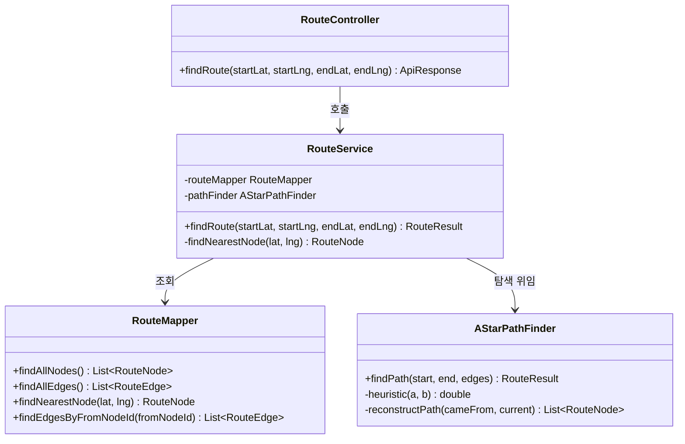
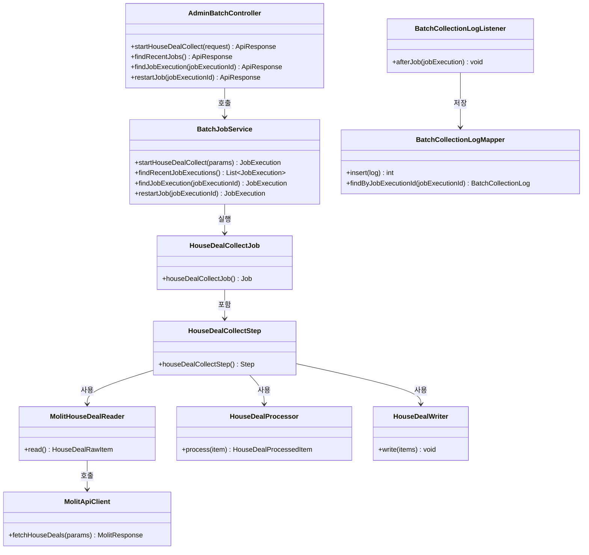
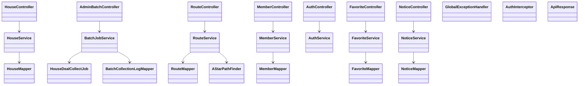

# 클래스 다이어그램

- 상태: 초안
- 작성자:
- 마지막 수정일: 2026-05-14
- 관련 요구사항: REQ-ROUTE-001, REQ-HOUSE-001, REQ-HOUSE-002, REQ-MEMBER-001, REQ-FAVORITE-001, REQ-NOTICE-001
- 관련 문서: [backend-architecture.md](backend-architecture.md), [package-structure.md](package-structure.md), [../07_algorithm/astar-route-planning.md](../07_algorithm/astar-route-planning.md)

---

## 클래스 목록

### 경로 탐색 도메인 (route)

| 클래스명 | 유형 | 책임 |
|---------|------|------|
| RouteController | Controller | GET /api/routes 엔드포인트 처리 |
| RouteService | Service | 출발·도착 좌표를 받아 가장 가까운 노드를 찾고 A* 탐색을 수행한다 |
| RouteMapper | Mapper (MyBatis) | `route_node`, `route_edge` 조회 |
| AStarPathFinder | Algorithm | RouteNode·RouteEdge 그래프에서 A* 알고리즘으로 최단 경로 탐색 |
| RouteNode | Domain | 그래프 노드 |
| RouteEdge | Domain | 그래프 엣지 |
| RouteResult | Domain | 탐색 결과 VO |

### 주택 및 배치 도메인

| 클래스명 | 유형 | 책임 |
|---------|------|------|
| HouseController | Controller | GET /api/houses, GET /api/houses/{id} 처리 |
| HouseService | Service | 주택 검색 조건 처리, 상세 조회, 거래 이력 조합 |
| HouseMapper | Mapper | house, house_deal 조회 |
| AdminBatchController | Controller | 관리자 배치 실행, 상태 조회, 재시작 API 처리 |
| BatchJobService | Service | JobLauncher 호출, 실행 이력 조회, 재시작 가능 여부 확인 |
| HouseDealCollectJob | Job | 주택 거래 수집 Job 정의 |
| HouseDealCollectStep | Step | 읽기·가공·저장 단위 실행 정의 |
| MolitHouseDealReader | Reader | 국토교통부 API 데이터 읽기 |
| HouseDealProcessor | Processor | 수집 데이터 검증·정규화·중복 판정 |
| HouseDealWriter | Writer | house, house_deal 저장 |
| BatchCollectionLogListener | Listener | 실행 결과 요약 및 `batch_collection_log` 기록 |
| BatchCollectionLogMapper | Mapper | `batch_collection_log` 저장 및 조회 |
| MolitApiClient | External Client | 국토교통부 REST API HTTP 호출 |

### 회원/인증 도메인

| 클래스명 | 유형 | 책임 |
|---------|------|------|
| MemberController | Controller | 회원 CRUD 처리 |
| MemberService | Service | 회원 가입 유효성 검사, 수정, 탈퇴 처리 |
| MemberMapper | Mapper | member 테이블 CRUD |
| AuthController | Controller | 로그인, 로그아웃, 인증 상태 확인 처리 |
| AuthService | Service | 이메일·비밀번호 검증, 세션 관리 |

### 관심 지역 / 공지사항 / 공통

| 클래스명 | 유형 | 책임 |
|---------|------|------|
| FavoriteController | Controller | 관심 지역 CRUD 처리 |
| FavoriteService | Service | 중복 등록 방지, 소유자 검사 |
| FavoriteMapper | Mapper | favorite_area 테이블 CRUD |
| NoticeController | Controller | 공지사항 CRUD 처리 |
| NoticeService | Service | 관리자 권한 확인 후 공지 처리 |
| NoticeMapper | Mapper | notice 테이블 CRUD |
| GlobalExceptionHandler | `@ControllerAdvice` | 전체 예외를 공통 오류 응답으로 변환 |
| AuthInterceptor | HandlerInterceptor | 인증 필요 API 세션 유효성 검사 |
| ApiResponse<T> | VO | 공통 HTTP 응답 래퍼 |

---

## Mermaid 클래스 다이어그램 — 경로 탐색 도메인

초기 구현 기준 `RouteMapper`는 `findAllNodes()`, `findAllEdges()`, `findNearestNode(lat, lng)`를 사용한다. `findEdgesByFromNodeId(fromNodeId)`는 그래프 규모가 커질 때 적용할 수 있는 향후 최적화 메서드다.

---

## Mermaid 클래스 다이어그램 — 배치 도메인

---

## Mermaid 클래스 다이어그램 — 전체 구조 요약

---

## 클래스 다이어그램 작성 가이드

1. **문서 기준**: Markdown 내 Mermaid 다이어그램을 기준 소스로 유지한다.
2. **저장 위치**: 정제된 이미지는 `assets/diagrams/class-{도메인}-YYYYMMDD.png`에 저장한다.
3. **표기**: UML 표준 클래스 다이어그램 표기법을 사용한다.
4. **포함 범위**: 레이어 간 의존 관계, 주요 메서드 시그니처, 도메인 클래스 속성을 포함한다.
5. **REQ-ROUTE-001 관련 클래스는 반드시 포함**한다: RouteController, RouteService, RouteMapper, AStarPathFinder, RouteNode, RouteEdge, RouteResult.
6. **REQ-HOUSE-001 배치 관련 클래스도 포함**한다: AdminBatchController, BatchJobService, HouseDealCollectJob, BatchCollectionLogListener.
