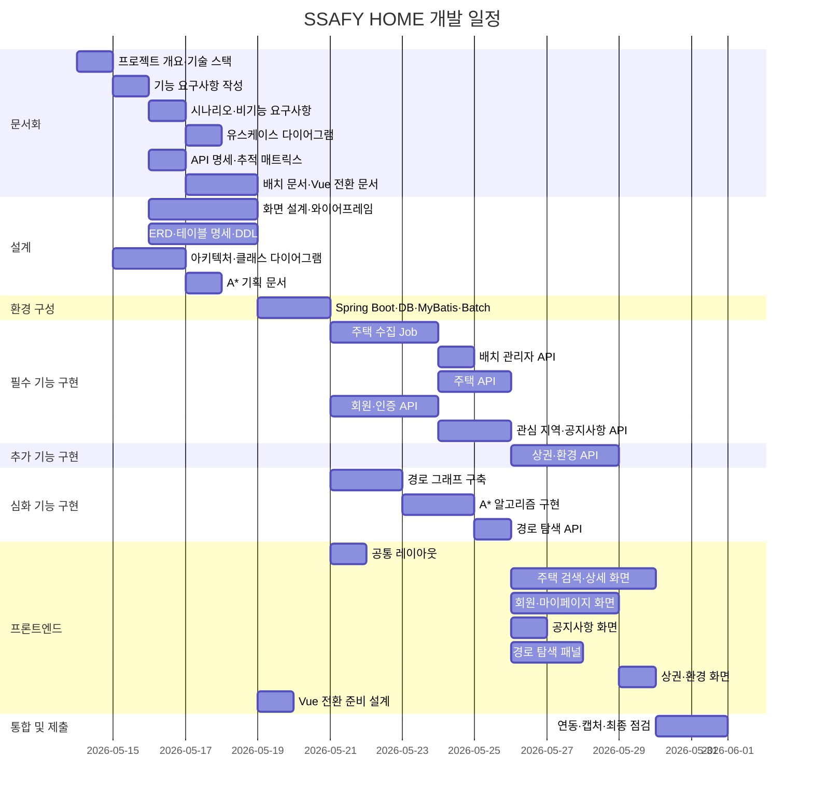

# 간트 차트

- 상태: 초안
- 작성자:
- 마지막 수정일: 2026-05-14
- 관련 요구사항: 전체
- 관련 문서: [wbs.md](wbs.md)

---

## 간트 차트 목적

간트 차트는 WBS 작업의 시작일, 종료일, 선후행 관계를 시각화해 일정 진행 상황을 팀이 공유하는 도구다. 아래 일정은 프로젝트 시작일을 기준으로 한 상대적 일정 계획이다. 실제 날짜는 팀 합의 후 확정한다.

---

## 일정 표 (상대 일정 기준)

| 작업 | WBS | 소요(일) | 시작(D+) | 종료(D+) | 선행 |
|------|-----|---------|---------|---------|------|
| 프로젝트 개요·기술 스택 | 1.1, 1.2 | 1 | 0 | 1 | — |
| 기능 요구사항 작성 | 1.3 | 1 | 1 | 2 | 1.1 |
| 비기능 요구사항·시나리오 작성 | 1.4, 1.5 | 1 | 2 | 3 | 1.3 |
| 유스케이스 다이어그램 | 1.6 | 1 | 3 | 4 | 1.5 |
| API 명세·추적 매트릭스 | 1.7, 1.8 | 1 | 2 | 3 | 1.3 |
| 배치 문서·Vue 전환 문서 | 1.9, 1.10 | 2 | 3 | 5 | 1.7 |
| 화면 설계 및 와이어프레임 | 2.1, 2.2 | 3 | 2 | 5 | 1.3 |
| ERD·테이블 명세·DDL·배치 로그 설계 | 2.3, 2.4, 2.9 | 2.5 | 2 | 4.5 | 1.3 |
| 백엔드 아키텍처·패키지·클래스 다이어그램 | 2.5~2.7 | 2 | 2 | 4 | 1.2 |
| A* 알고리즘 기획 문서 | 2.8 | 1 | 4 | 5 | 2.7 |
| 환경 구성 (Spring Boot, DB, MyBatis, Batch) | 3.1~3.5 | 2 | 4.5 | 6.5 | 2.4 |
| 행정구역 수집 설계·주택 수집 Job 구현 | 4.1, 4.2 | 2.5 | 6.5 | 9 | 3.4 |
| 배치 관리자 API 구현 | 4.3 | 1 | 9 | 10 | 4.2 |
| 주택 API 구현 | 4.4 | 2 | 9 | 11 | 4.2 |
| 회원·인증 API 구현 | 4.5, 4.6 | 2.5 | 6.5 | 9 | 3.5 |
| 관심 지역·공지사항 API | 4.7, 4.8 | 2 | 9 | 11 | 4.6 |
| 상권·환경 API 구현 | 5.1, 5.2 | 3 | 11 | 14 | 4.4 |
| 경로 그래프 데이터 구축 | 6.1 | 2 | 6.5 | 8.5 | 3.2 |
| A* 알고리즘 구현 | 6.2 | 2 | 8.5 | 10.5 | 6.1 |
| 경로 탐색 API | 6.3 | 1 | 10.5 | 11.5 | 6.2 |
| 프론트엔드 공통 레이아웃 | 7.1 | 1 | 6.5 | 7.5 | 2.2 |
| 주택 검색·결과·상세 화면 | 7.2, 7.3 | 4 | 7.5 | 11.5 | 4.4, 7.1 |
| 로그인·회원 가입·마이페이지 화면 | 7.4, 7.5 | 2.5 | 11.5 | 14 | 4.7, 7.1 |
| 공지사항 화면 | 7.6 | 1 | 11.5 | 12.5 | 4.8, 7.1 |
| 경로 탐색 패널 | 7.7 | 1.5 | 11.5 | 13 | 6.3, 7.3 |
| 상권·환경 화면 | 7.8 | 1 | 14 | 15 | 5.1, 5.2, 7.3 |
| Vue 전환 준비 설계 | 7.9 | 0.5 | 5 | 5.5 | 1.10 |
| 통합 연동·화면 캡처·최종 점검 | 8.1~8.3 | 2 | 15 | 17 | 7.8 |

---

## 의존성 메모

- 모든 API 구현은 환경 구성 완료 후 시작한다.
- 배치 관리자 API는 Spring Batch 설정과 `houseDealCollectJob` 구현 후 시작한다.
- 프론트엔드 화면 구현은 해당 도메인 API 구현과 병렬로 진행할 수 있으나, 최종 연동은 API 완료 후 진행한다.
- A* 알고리즘은 경로 그래프 데이터 구축과 알고리즘 기획 문서 작성이 모두 완료된 후 시작한다.
- Vue.js는 현재 구현 대상이 아니며, 일정에는 전환 준비 문서 작업만 포함한다.

---

## 진행 상황 업데이트 방법

1. WBS 표(`wbs.md`)에서 각 작업의 상태를 갱신한다.
2. 이 문서의 일정 표에서 실제 시작일·종료일과 예상값을 비교해 지연 여부를 파악한다.
3. 지연 작업은 이 문서의 비고 컬럼에 사유를 기재한다.
4. 실제 날짜 확정 후 Mermaid Gantt를 업데이트한다.

---

## Mermaid 간트 초안 (상대 일정)

실제 시작일 확정 후 날짜를 업데이트한다. 아래는 D+0 = 2026-05-14 기준 예시다.

