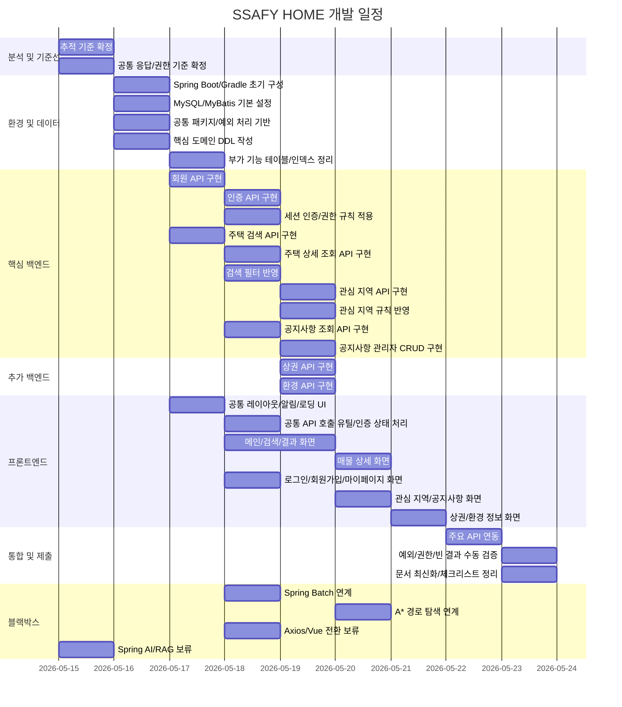

# 간트 차트

- 상태: 완료
- 작성자:
- 마지막 수정일: 2026-05-15
- 관련 요구사항: 전체
- 관련 문서: [wbs.md](wbs.md)

---

## 일정 표

| 작업 | WBS | 시작일 | 종료일 | 소요 | 선행 |
|------|-----|--------|--------|------|------|
| 요구사항-화면-API-DB 추적 기준 확정 | 1.1 | 2026-05-15 | 2026-05-15 | 0.5일 | — |
| 공통 응답/에러/권한 기준 확정 | 1.2 | 2026-05-15 | 2026-05-15 | 0.5일 | 1.1 |
| Spring Boot/Gradle 초기 구성 | 2.1 | 2026-05-16 | 2026-05-16 | 0.5일 | 1.2 |
| MySQL/MyBatis 연결 및 기본 설정 | 2.2 | 2026-05-16 | 2026-05-16 | 0.5일 | 2.1 |
| 공통 패키지 구조 및 예외 처리 기반 구성 | 2.3 | 2026-05-16 | 2026-05-16 | 0.5일 | 2.1 |
| 핵심 도메인 테이블 DDL 작성 | 3.1 | 2026-05-16 | 2026-05-16 | 1일 | 1.2 |
| 부가 기능 테이블 및 인덱스 정리 | 3.2 | 2026-05-17 | 2026-05-17 | 1일 | 3.1 |
| 회원 API 구현 | 4.1 | 2026-05-17 | 2026-05-17 | 1일 | 2.3, 3.1 |
| 인증 API 구현 | 4.2 | 2026-05-18 | 2026-05-18 | 0.5일 | 4.1 |
| 세션 인증 인터셉터 및 권한 규칙 적용 | 4.3 | 2026-05-18 | 2026-05-18 | 0.5일 | 4.2 |
| 주택 검색 API 구현 | 4.4 | 2026-05-17 | 2026-05-17 | 1일 | 3.1 |
| 주택 상세 조회 API 구현 | 4.5 | 2026-05-18 | 2026-05-18 | 1일 | 4.4 |
| 거래 유형/금액 범위 필터 반영 | 4.6 | 2026-05-18 | 2026-05-18 | 0.5일 | 4.4 |
| 관심 지역 API 구현 | 4.7 | 2026-05-19 | 2026-05-19 | 0.5일 | 4.3, 3.2 |
| 관심 지역 중복 등록 방지 및 권한 검증 | 4.8 | 2026-05-19 | 2026-05-19 | 0.5일 | 4.7 |
| 공지사항 조회 API 구현 | 4.9 | 2026-05-18 | 2026-05-18 | 0.5일 | 3.2 |
| 공지사항 관리자 CRUD 및 권한 검증 | 4.10 | 2026-05-19 | 2026-05-19 | 0.5일 | 4.3, 4.9 |
| 상권 조회 API 및 업종 필터 구현 | 5.1 | 2026-05-19 | 2026-05-19 | 1일 | 4.5, 3.2 |
| 환경 정보 조회 API 구현 | 5.2 | 2026-05-19 | 2026-05-19 | 1일 | 4.5, 3.2 |
| 공통 레이아웃/알림/로딩 UI 구성 | 6.1 | 2026-05-17 | 2026-05-17 | 1일 | 1.2 |
| 공통 API 호출 유틸 및 인증 상태 처리 | 6.2 | 2026-05-18 | 2026-05-18 | 0.5일 | 6.1, 4.2 |
| 메인/검색/결과 화면 구현 | 6.3 | 2026-05-18 | 2026-05-19 | 1.5일 | 6.1, 4.4 |
| 매물 상세 화면 구현 | 6.4 | 2026-05-20 | 2026-05-20 | 1일 | 6.3, 4.5 |
| 로그인/회원가입/마이페이지 화면 구현 | 6.5 | 2026-05-18 | 2026-05-18 | 1일 | 6.2, 4.1, 4.2 |
| 관심 지역/공지사항 화면 구현 | 6.6 | 2026-05-20 | 2026-05-20 | 1일 | 6.2, 4.7, 4.9, 4.10 |
| 상권/환경 정보 화면 구현 | 6.7 | 2026-05-21 | 2026-05-21 | 1일 | 6.4, 5.1, 5.2 |
| 주요 API 연동 | 7.1 | 2026-05-22 | 2026-05-22 | 1일 | 4.1~5.2, 6.2~6.7 |
| 예외/권한/빈 결과 수동 검증 | 7.2 | 2026-05-23 | 2026-05-23 | 0.5일 | 7.1 |
| API/요구사항 문서 최신화 및 제출 체크리스트 정리 | 8.1 | 2026-05-23 | 2026-05-23 | 0.5일 | 7.2 |
| Spring Batch 연계 | 9.1 | 2026-05-18 | 2026-05-18 | 0.5일 | 3.1 |
| A* 경로 탐색 연계 | 9.2 | 2026-05-20 | 2026-05-20 | 0.5일 | 4.5, 6.4 |
| Axios/Vue 전환 보류 | 9.3 | 2026-05-18 | 2026-05-18 | 0.5일 | 6.2 |
| Spring AI / RAG 보류 | 9.4 | 2026-05-15 | 2026-05-15 | 0.5일 | — |

---

## Mermaid 간트 차트

